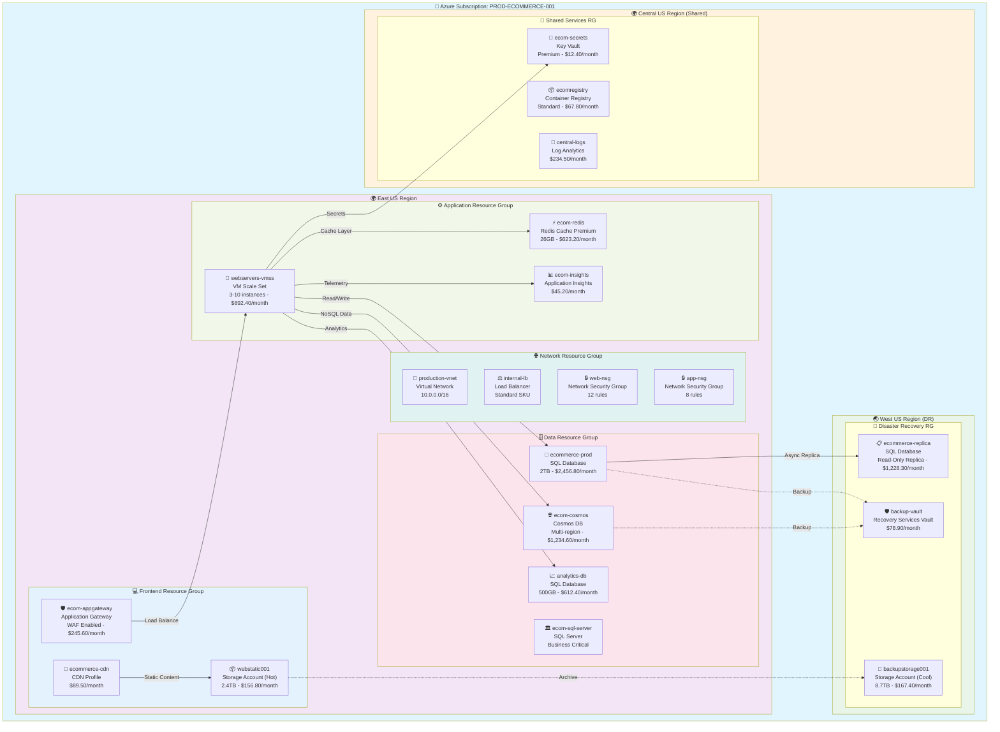

# 🌩️ CloudViz - Multi-Cloud Infrastructure Visualization Platform

[](https://opensource.org/licenses/MIT)
[](https://www.python.org/downloads/)
[](https://fastapi.tiangolo.com/)
[](https://mermaid.js.org/)

**CloudViz** is an enterprise-grade, multi-cloud infrastructure visualization platform that automatically discovers cloud resources and generates beautiful, interactive diagrams. Built with FastAPI and featuring powerful Mermaid diagram generation, CloudViz provides REST APIs perfect for automation workflows, especially **n8n integration**.

## 🎨 **Live Infrastructure Visualization Demo**

CloudViz automatically generates comprehensive infrastructure diagrams from your cloud resources. Here's a real-world example:

### 🏢 **Enterprise E-Commerce Platform Architecture**
*Auto-generated from Azure subscription scan - realistic dummy data demonstration*



## 🚀 **Key Features**

### 🎨 **Advanced Mermaid Visualization**
- **Real-time Infrastructure Mapping**: Auto-discovery and live diagram generation
- **Interactive Diagrams**: Clickable nodes with detailed resource information
- **Multiple Export Formats**: Mermaid markdown, PNG, SVG, PDF
- **Custom Themes**: Professional, dark mode, high-contrast accessibility themes

### 🔧 **Enterprise Integration**
- **FastAPI Framework**: High-performance async API with automatic OpenAPI documentation
- **Multi-Cloud Support**: Azure, AWS, GCP resource discovery
- **Authentication & Security**: JWT tokens, role-based access control
- **Scalable Architecture**: Microservices-ready with Docker/Kubernetes support

## 📡 **n8n Integration Workflows**

CloudViz is designed for seamless **n8n** automation. Here are complete workflow examples:

### 🔍 **Daily Infrastructure Discovery Workflow**

```json
{
  "name": "CloudViz Daily Discovery",
  "nodes": [
    {
      "parameters": {
        "rule": {
          "interval": [{"field": "cronExpression", "value": "0 6 * * *"}]
        }
      },
      "name": "Daily 6AM Trigger",
      "type": "n8n-nodes-base.cron",
      "position": [240, 300]
    },
    {
      "parameters": {
        "url": "http://cloudviz-api:8000/api/v1/discovery/scan",
        "authentication": "genericCredentialType",
        "genericAuthType": "httpHeaderAuth",
        "httpMethod": "POST",
        "jsonParameters": true,
        "options": {},
        "bodyParametersJson": "={\n  \"providers\": [\"azure\", \"aws\"],\n  \"regions\": [\"eastus\", \"westus2\", \"us-east-1\"],\n  \"resource_types\": [\"compute\", \"network\", \"storage\", \"database\"],\n  \"include_costs\": true,\n  \"include_tags\": true\n}"
      },
      "name": "CloudViz Resource Scan",
      "type": "n8n-nodes-base.httpRequest",
      "position": [460, 300]
    },
    {
      "parameters": {
        "url": "=http://cloudviz-api:8000/api/v1/visualize/mermaid",
        "authentication": "genericCredentialType",
        "genericAuthType": "httpHeaderAuth",
        "httpMethod": "POST",
        "jsonParameters": true,
        "bodyParametersJson": "={\n  \"inventory_data\": {{ $json.inventory }},\n  \"diagram_type\": \"infrastructure\",\n  \"theme\": \"professional\",\n  \"include_costs\": true,\n  \"group_by\": \"resource_group\",\n  \"export_format\": \"mermaid_markdown\"\n}"
      },
      "name": "Generate Mermaid Diagram",
      "type": "n8n-nodes-base.httpRequest",
      "position": [680, 300]
    },
    {
      "parameters": {
        "values": {
          "string": [
            {"name": "summary", "value": "=📊 **Daily Infrastructure Report**\\n\\n**Scan Date**: {{ $now.format('YYYY-MM-DD HH:mm:ss') }}\\n**Resources Found**: {{ $('CloudViz Resource Scan').item.json.summary.total_resources }}\\n**Monthly Cost**: ${{ $('CloudViz Resource Scan').item.json.summary.estimated_monthly_cost }}\\n\\n**Mermaid Diagram**:\\n```mermaid\\n{{ $('Generate Mermaid Diagram').item.json.diagram }}\\n```\\n\\n**Resource Breakdown**:\\n{{ $('CloudViz Resource Scan').item.json.summary.resource_breakdown }}"}
          ]
        }
      },
      "name": "Format Report",
      "type": "n8n-nodes-base.set",
      "position": [900, 300]
    },
    {
      "parameters": {
        "subject": "=🌩️ Daily CloudViz Infrastructure Report - {{ $now.format('MMM DD') }}",
        "message": "={{ $json.summary }}",
        "options": {
          "appendN8nAttribution": false
        }
      },
      "name": "Email Infrastructure Report",
      "type": "n8n-nodes-base.emailSend",
      "position": [1120, 300]
    }
  ],
  "connections": {
    "Daily 6AM Trigger": {"main": [["CloudViz Resource Scan"]]},
    "CloudViz Resource Scan": {"main": [["Generate Mermaid Diagram"]]},
    "Generate Mermaid Diagram": {"main": [["Format Report"]]},
    "Format Report": {"main": [["Email Infrastructure Report"]]}
  }
}
```

### 🚨 **Incident Response Workflow**

```json
{
  "name": "CloudViz Incident Response",
  "nodes": [
    {
      "parameters": {
        "httpMethod": "POST",
        "path": "cloudviz-incident",
        "options": {}
      },
      "name": "Incident Webhook",
      "type": "n8n-nodes-base.webhook",
      "position": [240, 300]
    },
    {
      "parameters": {
        "conditions": {
          "string": [
            {"value1": "={{ $json.body.severity }}", "operation": "equal", "value2": "high"}
          ]
        }
      },
      "name": "High Severity Check",
      "type": "n8n-nodes-base.if",
      "position": [460, 300]
    },
    {
      "parameters": {
        "url": "http://cloudviz-api:8000/api/v1/discovery/scan",
        "httpMethod": "POST",
        "jsonParameters": true,
        "bodyParametersJson": "={\n  \"providers\": [\"{{ $json.body.provider }}\"],\n  \"regions\": [\"{{ $json.body.region }}\"],\n  \"resource_groups\": [\"{{ $json.body.affected_resource_group }}\"],\n  \"include_health_status\": true,\n  \"include_recent_changes\": true\n}"
      },
      "name": "Emergency Resource Scan",
      "type": "n8n-nodes-base.httpRequest",
      "position": [680, 300]
    },
    {
      "parameters": {
        "url": "http://cloudviz-api:8000/api/v1/visualize/mermaid",
        "httpMethod": "POST",
        "jsonParameters": true,
        "bodyParametersJson": "={\n  \"inventory_data\": {{ $json.inventory }},\n  \"diagram_type\": \"incident_analysis\",\n  \"theme\": \"alert\",\n  \"highlight_unhealthy\": true,\n  \"show_dependencies\": true,\n  \"export_format\": \"mermaid_markdown\"\n}"
      },
      "name": "Generate Incident Diagram",
      "type": "n8n-nodes-base.httpRequest",
      "position": [900, 300]
    },
    {
      "parameters": {
        "channel": "#incidents",
        "text": "=🚨 **HIGH SEVERITY INCIDENT DETECTED**\\n\\n**Incident ID**: {{ $('Incident Webhook').item.json.body.incident_id }}\\n**Affected Resource Group**: {{ $('Incident Webhook').item.json.body.affected_resource_group }}\\n\\n**Current Infrastructure State**:\\n```mermaid\\n{{ $json.diagram }}\\n```\\n\\n**Unhealthy Resources**: {{ $('Emergency Resource Scan').item.json.summary.unhealthy_resources }}\\n**Recommended Actions**: {{ $('Emergency Resource Scan').item.json.recommendations }}"
      },
      "name": "Slack Alert with Diagram",
      "type": "n8n-nodes-base.slack",
      "position": [1120, 300]
    }
  ],
  "connections": {
    "Incident Webhook": {"main": [["High Severity Check"]]},
    "High Severity Check": {"main": [["Emergency Resource Scan"], []]},
    "Emergency Resource Scan": {"main": [["Generate Incident Diagram"]]},
    "Generate Incident Diagram": {"main": [["Slack Alert with Diagram"]]}
  }
}
```

## 🛠️ **Quick Start**

### 🐳 **Docker Deployment** (Recommended)

```bash
git clone https://github.com/navidrast/cloudviz.git
cd cloudviz
docker-compose up -d
```

### 📦 **Local Development**

```bash
uvicorn cloudviz.api.main:app --host 0.0.0.0 --port 8000 --reload
```

## 🔌 **API Endpoints**

CloudViz provides comprehensive REST APIs optimized for automation workflows:

### **Discovery & Scanning**
- `POST /api/v1/discovery/scan` - Scan cloud resources across providers
- `GET /api/v1/discovery/status/{scan_id}` - Check scan progress
- `GET /api/v1/inventory/resources` - Retrieve discovered resources

### **Visualization & Diagrams**  
- `POST /api/v1/visualize/mermaid` - Generate Mermaid diagram from inventory
- `POST /api/v1/visualize/export` - Export diagrams (PNG, SVG, PDF)
- `GET /api/v1/templates/themes` - Available diagram themes

### **n8n Integration Helpers**
- `POST /api/v1/webhooks/n8n/trigger-scan` - n8n-optimized scan endpoint
- `POST /api/v1/webhooks/n8n/generate-report` - Auto-formatted reports
- `GET /api/v1/health/n8n` - n8n health check endpoint

## 📋 **Advanced Configuration Examples**

### **Docker Compose for n8n Integration**

```yaml
version: '3.8'
services:
  cloudviz-api:
    image: navidrast/cloudviz:latest
    ports:
      - "8000:8000"
    environment:
      - AZURE_CLIENT_ID=${AZURE_CLIENT_ID}
      - AZURE_CLIENT_SECRET=${AZURE_CLIENT_SECRET}
      - AZURE_TENANT_ID=${AZURE_TENANT_ID}
      - AWS_ACCESS_KEY_ID=${AWS_ACCESS_KEY_ID}
      - AWS_SECRET_ACCESS_KEY=${AWS_SECRET_ACCESS_KEY}
      - REDIS_URL=redis://redis:6379
    depends_on:
      - redis
    networks:
      - cloudviz-network

  redis:
    image: redis:7-alpine
    networks:
      - cloudviz-network

  n8n:
    image: n8nio/n8n:latest
    ports:
      - "5678:5678"
    environment:
      - N8N_HOST=0.0.0.0
      - N8N_PORT=5678
      - WEBHOOK_TUNNEL_URL=http://localhost:5678/
    volumes:
      - n8n_data:/home/node/.n8n
    networks:
      - cloudviz-network

networks:
  cloudviz-network:
    driver: bridge

volumes:
  n8n_data:
```

### **Kubernetes Deployment**

```yaml
apiVersion: apps/v1
kind: Deployment
metadata:
  name: cloudviz-api
spec:
  replicas: 3
  selector:
    matchLabels:
      app: cloudviz-api
  template:
    metadata:
      labels:
        app: cloudviz-api
    spec:
      containers:
      - name: cloudviz
        image: navidrast/cloudviz:latest
        ports:
        - containerPort: 8000
        env:
        - name: AZURE_CLIENT_ID
          valueFrom:
            secretKeyRef:
              name: azure-credentials
              key: client-id
        - name: REDIS_URL
          value: "redis://redis-service:6379"
        resources:
          requests:
            memory: "256Mi"
            cpu: "250m"
          limits:
            memory: "512Mi"
            cpu: "500m"
---
apiVersion: v1
kind: Service
metadata:
  name: cloudviz-service
spec:
  selector:
    app: cloudviz-api
  ports:
  - port: 8000
    targetPort: 8000
  type: LoadBalancer
```

## 🔐 **Security & Authentication**

CloudViz implements enterprise-grade security:

- **JWT Authentication**: Secure API access with refresh tokens
- **Role-Based Access Control**: Admin, Operator, Viewer roles
- **Credential Management**: Secure cloud provider credential storage
- **API Rate Limiting**: Configurable request throttling
- **Audit Logging**: Complete API access logging

## 📊 **Monitoring & Observability**

- **Health Checks**: `/health` endpoint for container orchestration
- **Metrics Export**: Prometheus-compatible metrics
- **Structured Logging**: JSON logs with correlation IDs
- **Performance Monitoring**: Request timing and resource usage

## 🤝 **Contributing**

We welcome contributions! Please see our [Contributing Guide](CONTRIBUTING.md) for details.

## 📄 **License**

This project is licensed under the MIT License - see the [LICENSE](LICENSE) file for details.

�️
