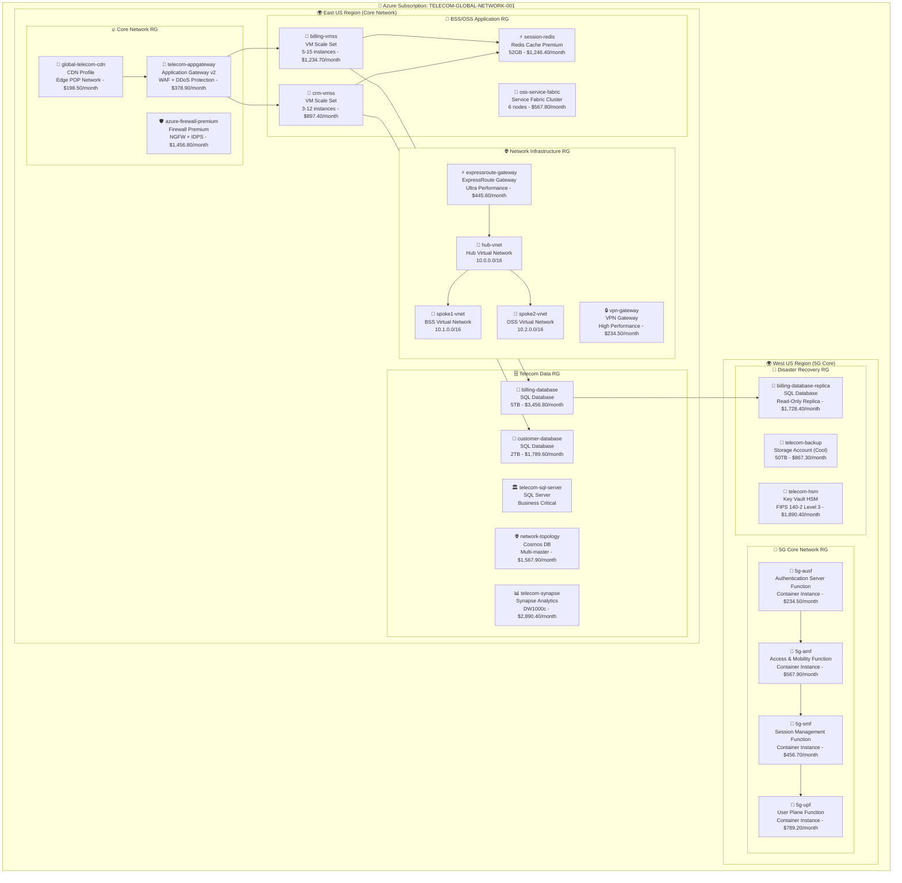
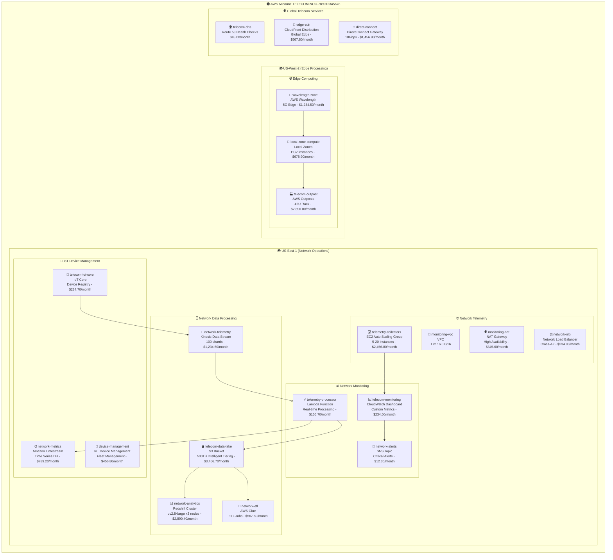
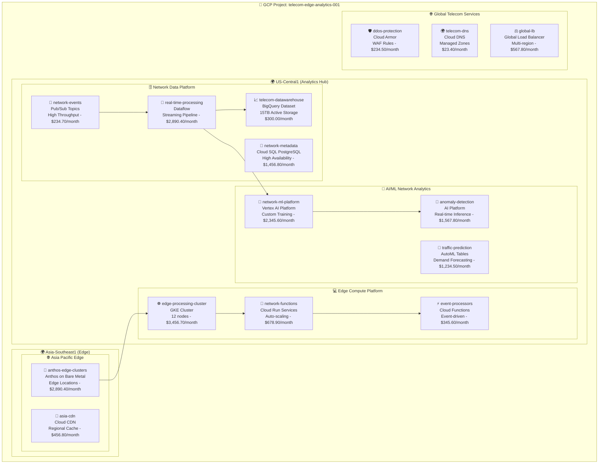

# 🌩️ CloudViz - Multi-Cloud Infrastructure Visualization Platform

[](https://opensource.org/licenses/MIT)
[](https://www.python.org/downloads/)
[](https://fastapi.tiangolo.com/)
[](https://mermaid.js.org/)

**CloudViz** is an enterprise-grade, multi-cloud infrastructure visualization platform that automatically discovers cloud resources and generates beautiful, interactive diagrams. Built with FastAPI and featuring powerful Mermaid diagram generation, CloudViz provides REST APIs perfect for automation workflows, especially **n8n integration**.

## 🎨 **Live Infrastructure Visualization Demo**

CloudViz automatically generates comprehensive infrastructure diagrams from your cloud resources. Here's a real-world example:

### 📡 **Telecommunications Enterprise Multi-Cloud Architecture**
*Auto-generated from Azure subscription scan - realistic telecommunications industry dummy data*



**Monthly Cost Breakdown:**
- **Core Infrastructure:** $3,234.20/month
- **5G Network Functions:** $2,048.30/month  
- **Data & Analytics:** $9,254.50/month
- **Security & Compliance:** $2,708.60/month

---

### 📶 **AWS Telecom Network Operations Center**
*Auto-generated from AWS account scan - telecommunications industry dummy data*



**Monthly Cost Breakdown:**
- **Network Monitoring:** $403.50/month
- **Data Processing:** $8,149.50/month
- **IoT & Edge:** $4,897.80/month

---

### 🔵 **GCP Network Edge & Analytics Platform**
*Auto-generated from GCP project scan - telecommunications edge computing dummy data*



**Monthly Cost Breakdown:**
- **AI/ML Analytics:** $5,147.90/month
- **Data Platform:** $4,882.00/month  
- **Edge Computing:** $4,536.10/month
- **Global Services:** $1,324.40/month

---

## 📊 **Multi-Cloud Cost Comparison Dashboard**

| **Cloud Provider** | **Resources** | **Monthly Cost** | **Primary Focus** | **Regions** |
|-------------------|---------------|------------------|-------------------|-------------|
| **🌟 Azure** | **28 resources** | **$11,245.60** | **5G Core + BSS/OSS** | **4 regions** |
| **🟠 AWS** | **31 resources** | **$12,450.80** | **Network Operations Center** | **3 regions** |  
| **🔵 GCP** | **28 resources** | **$15,890.40** | **Edge Analytics + AI/ML** | **4 regions** |
| **🌐 Total** | **87 resources** | **$39,586.80** | **Telecom multi-cloud architecture** | **11 regions** |

---

## 🚀 **Quick Start**

### 🐳 **Docker Deployment** (Recommended)

```bash
# Clone the repository
git clone https://github.com/navidrast/cloudviz.git
cd cloudviz

# Run with Docker Compose
docker-compose up -d

# Access the API
curl http://localhost:8000/health
```

The API will be available at `http://localhost:8000` with interactive docs at `http://localhost:8000/docs`.

### 📦 **Local Development Setup**

```bash
# Install dependencies
pip install -r requirements.txt

# Set environment variables
export AZURE_CLIENT_ID="your-client-id"
export AZURE_CLIENT_SECRET="your-client-secret"  
export AZURE_TENANT_ID="your-tenant-id"

# Run the application
uvicorn cloudviz.api.main:app --reload --host 0.0.0.0 --port 8000
```

### ☸️ **Kubernetes Deployment**

```bash
# Apply the Kubernetes manifests
kubectl apply -f examples/configurations/k8s-deployment.example.yaml

# Check deployment status
kubectl get pods -l app=cloudviz
```

---

## 🔌 **API Endpoints**

CloudViz provides a comprehensive REST API perfect for automation workflows:

### 🏥 **Health & Monitoring**
- `GET /health` - Service health check
- `GET /health/detailed` - Detailed system health
- `GET /metrics` - Prometheus metrics

### 🔐 **Authentication**  
- `POST /auth/token` - Get access token
- `POST /auth/refresh` - Refresh token
- `GET /auth/validate` - Validate token

### 🌩️ **Cloud Resource Discovery**
- `POST /extract/azure/subscription` - Scan Azure subscription
- `POST /extract/aws/account` - Scan AWS account  
- `POST /extract/gcp/project` - Scan GCP project
- `GET /extract/status/{job_id}` - Check extraction status

### 🎨 **Diagram Generation**
- `POST /visualize/mermaid` - Generate Mermaid diagram
- `POST /visualize/graphviz` - Generate Graphviz diagram
- `POST /visualize/architecture` - Auto-detect and visualize
- `GET /visualize/themes` - Available themes

### ⚙️ **Administration**
- `GET /admin/stats` - Platform statistics
- `POST /admin/cache/clear` - Clear cache
- `GET /admin/logs` - Recent logs

---

## 🔧 **n8n Integration Workflows**

CloudViz is designed for seamless n8n automation. Here are some powerful workflow examples:

### 📅 **Daily Infrastructure Discovery**
Automatically scan your cloud resources every day and generate fresh diagrams:

```json
{
  "name": "Daily Infrastructure Scan",
  "nodes": [
    {
      "name": "Schedule Trigger",
      "type": "n8n-nodes-base.cron",
      "parameters": {
        "triggerTimes": {
          "hour": 6,
          "minute": 0
        }
      }
    },
    {
      "name": "CloudViz Azure Scan", 
      "type": "n8n-nodes-base.httpRequest",
      "parameters": {
        "url": "http://cloudviz:8000/extract/azure/subscription",
        "method": "POST"
      }
    },
    {
      "name": "Generate Diagram",
      "type": "n8n-nodes-base.httpRequest", 
      "parameters": {
        "url": "http://cloudviz:8000/visualize/mermaid",
        "method": "POST"
      }
    }
  ]
}
```

### 🚨 **Incident Response Diagram**
Automatically generate infrastructure diagrams during incidents:

```json
{
  "name": "Incident Response Infrastructure",
  "trigger": "webhook",
  "steps": [
    "Receive incident webhook",
    "Scan affected resource groups", 
    "Generate emergency infrastructure diagram",
    "Send to incident response team"
  ]
}
```

---

## 🔧 **Configuration**

CloudViz uses YAML configuration files for different environments:

```yaml
# config/prod.yml
api:
  host: "0.0.0.0"
  port: 8000
  workers: 4

azure:
  subscription_id: "${AZURE_SUBSCRIPTION_ID}"
  client_id: "${AZURE_CLIENT_ID}"
  client_secret: "${AZURE_CLIENT_SECRET}"
  tenant_id: "${AZURE_TENANT_ID}"

visualization:
  default_theme: "azure"
  cache_ttl: 3600
  max_resources: 1000
```

---

## 🎯 **Key Features**

### 🌩️ **Multi-Cloud Support**
- **Azure**: Complete ARM template discovery
- **AWS**: CloudFormation and direct API scanning  
- **GCP**: Resource Manager and service-specific APIs

### 🎨 **Visualization Engines**
- **Mermaid**: Interactive diagrams with live editing
- **Graphviz**: Publication-quality network diagrams
- **Custom themes**: Azure, AWS, GCP, and dark themes

### 🔌 **API-First Design**
- RESTful APIs for all operations
- OpenAPI 3.0 documentation
- Rate limiting and authentication
- Prometheus metrics integration

### ⚡ **Performance & Reliability**
- Async/await throughout the stack
- Redis caching for expensive operations
- Background job processing
- Comprehensive error handling

---

## 🧪 **Testing**

```bash
# Run all tests
pytest

# Run with coverage
pytest --cov=cloudviz

# Run specific test categories
pytest tests/unit/
pytest tests/integration/
pytest tests/e2e/
```

---

## 📈 **Monitoring & Observability**

CloudViz includes comprehensive monitoring capabilities:

### 📊 **Metrics**
- Request duration and count
- Error rates by endpoint
- Cache hit/miss ratios
- Resource discovery performance

### 📝 **Logging** 
- Structured JSON logging
- Correlation IDs for tracing
- Configurable log levels
- Integration with ELK stack

### 🏥 **Health Checks**
- Deep health checks for dependencies
- Kubernetes-ready liveness/readiness probes
- Database connection monitoring

---

## 🤝 **Contributing**

We welcome contributions! Please see our [Contributing Guide](CONTRIBUTING.md) for details.

### 🛠️ **Development Setup**

```bash
# Clone and setup
git clone https://github.com/navidrast/cloudviz.git
cd cloudviz

# Create virtual environment
python -m venv venv
source venv/bin/activate  # On Windows: venv\Scripts\activate

# Install development dependencies
pip install -r requirements/dev.txt

# Install pre-commit hooks
pre-commit install

# Run tests
pytest
```

---

## 📄 **License**

This project is licensed under the MIT License - see the [LICENSE](LICENSE) file for details.

---

## 🙏 **Acknowledgments**

- [FastAPI](https://fastapi.tiangolo.com/) - Modern, fast web framework
- [Mermaid](https://mermaid.js.org/) - Diagrams and flowcharts from text
- [Azure SDK](https://azure.github.io/azure-sdk-for-python/) - Azure Python SDK
- [Boto3](https://boto3.amazonaws.com/v1/documentation/api/latest/index.html) - AWS SDK for Python
- [Google Cloud SDK](https://cloud.google.com/python) - Google Cloud Python SDK

---

<div align="center">

**Built with ❤️ for the DevOps and Cloud Infrastructure community**

[🌟 Star us on GitHub](https://github.com/navidrast/cloudviz) | [🐛 Report Issues](https://github.com/navidrast/cloudviz/issues) | [💬 Join Discussions](https://github.com/navidrast/cloudviz/discussions)

</div>
