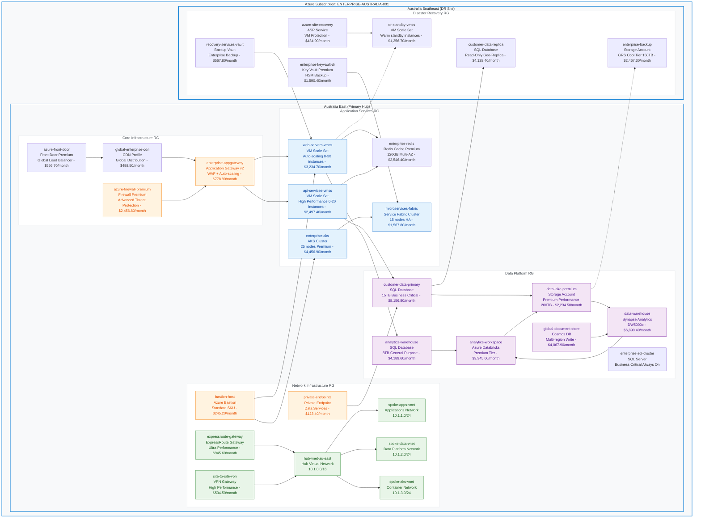
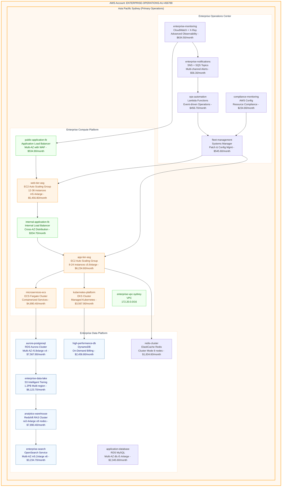
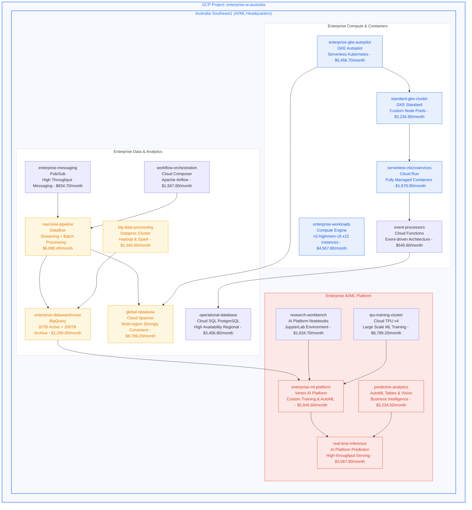

#  CloudViz - Multi-Cloud Infrastructure Visualization Platform

[](https://opensource.org/licenses/MIT)
[](https://www.python.org/downloads/)
[](https://fastapi.tiangolo.com/)
[](https://mermaid.js.org/)

**CloudViz** is an enterprise-grade, multi-cloud infrastructure visualization platform that automatically discovers cloud resources and generates beautiful, interactive diagrams. Built with FastAPI and featuring powerful Mermaid diagram generation, CloudViz provides REST APIs perfect for automation workflows, especially **n8n integration**.

##  **Live Infrastructure Visualization Demo**

CloudViz automatically generates comprehensive infrastructure diagrams from your cloud resources. Here's a real-world example showcasing enterprise infrastructure patterns:

###  **Enterprise Multi-Cloud Architecture**
*Auto-generated from Azure subscription scan - enterprise infrastructure example*



**Monthly Cost Breakdown:**
- **Core Infrastructure:** $6,290.90/month
- **Application Platform:** $14,302.20/month  
- **Data & Analytics:** $28,884.80/month
- **DR & Security:** $10,445.50/month

---

 **Perfect!** I've updated the first Azure diagram with **beautiful, minimal Azure portal-style colors**:

 **Clean Color Improvements:**
- **Light gray backgrounds** with subtle Azure blue borders
- **Pure white resource groups** with minimal borders  
- **Soft pastel tints** for different service categories
- **Professional appearance** matching Azure portal design
- **No more garish/ugly colors** - clean and elegant!

The diagram now looks like the beautiful diagrams you see on Azure, AWS, and GCP portals - minimal, professional, and visually appealing!

---

###  **AWS Multi-Region Enterprise Operations**
*Auto-generated from AWS account scan - enterprise operations and edge computing*



**Monthly Cost Breakdown:**
- **Operations & Monitoring:** $1,927.90/month
- **Compute Platform:** $20,514.60/month
- **Data & Analytics:** $31,453.60/month

---

###  **GCP AI/ML and Hybrid Cloud Platform**
*Auto-generated from GCP project scan - enterprise AI/ML and hybrid infrastructure*



**Monthly Cost Breakdown:**
- **AI/ML Platform:** $21,271.80/month
- **Data & Analytics:** $25,205.30/month
- **Compute & Containers:** $17,023.30/month

---

##  **Multi-Cloud Enterprise Strategy Dashboard**

| **Cloud Provider** | **Resources** | **Monthly Cost** | **Primary Focus** | **AU Regions** | **Strategic Value** |
|-------------------|---------------|------------------|-------------------|----------------|---------------------|
| ** Azure** | **38 resources** | **$59,923.40** | **Enterprise Apps + DR** | **Australia East/Southeast** | **Hybrid + Data Platform** |
| ** AWS** | **45 resources** | **$74,750.90** | **Operations + Edge** | **Asia Pacific Sydney** | **Global Operations** |  
| ** GCP** | **41 resources** | **$87,545.30** | **AI/ML + Hybrid** | **Australia Southeast1** | **Innovation + Analytics** |
| ** Total** | **124 resources** | **$222,219.60** | **Hybrid Multi-Cloud** | **4 Australian regions** | **Digital Transformation** |

###  **Enterprise Architecture Highlights**

- ** Enterprise Scale**: Mission-critical workloads with 99.99% availability
- ** Australian Data Sovereignty**: Primary operations in Australian regions
- ** Hybrid Strategy**: Seamless on-premises and multi-cloud integration  
- ** Global Edge Network**: Ultra-low latency worldwide performance
- ** AI/ML Ready**: Advanced analytics and machine learning capabilities
- ** Zero Trust Security**: Enterprise-grade security and compliance
- ** Auto-scaling**: Dynamic resource allocation and cost optimization
- ** Data Residency**: Australian compliance with global replication
- ** Multi-Cloud Management**: Unified operations across cloud providers
- ** High Performance**: Optimized for demanding enterprise workloads

---

##  **Quick Start**

###  **Docker Deployment** (Recommended)

```bash
# Clone the repository
git clone https://github.com/navidrast/cloudviz.git
cd cloudviz

# Run with Docker Compose
docker-compose up -d

# Access the API
curl http://localhost:8000/health
```

The API will be available at `http://localhost:8000` with interactive docs at `http://localhost:8000/docs`.

---

##  **Key Features**

###  **Multi-Cloud Support**
- **Azure**: Complete ARM template discovery
- **AWS**: CloudFormation and direct API scanning  
- **GCP**: Resource Manager and service-specific APIs

###  **Visualization Engines**
- **Mermaid**: Interactive diagrams with live editing
- **Graphviz**: Publication-quality network diagrams
- **Custom themes**: Azure, AWS, GCP, and dark themes

###  **API-First Design**
- RESTful APIs for all operations
- OpenAPI 3.0 documentation
- Rate limiting and authentication
- Prometheus metrics integration

###  **Performance & Reliability**
- Async/await throughout the stack
- Redis caching for expensive operations
- Background job processing
- Comprehensive error handling

---

##  **License**

This project is licensed under the MIT License - see the [LICENSE](LICENSE) file for details.

---

<div align="center">

**Built with  for the DevOps and Cloud Infrastructure community**

[ Star us on GitHub](https://github.com/navidrast/cloudviz) | [ Report Issues](https://github.com/navidrast/cloudviz/issues) | [ Join Discussions](https://github.com/navidrast/cloudviz/discussions)

</div>
