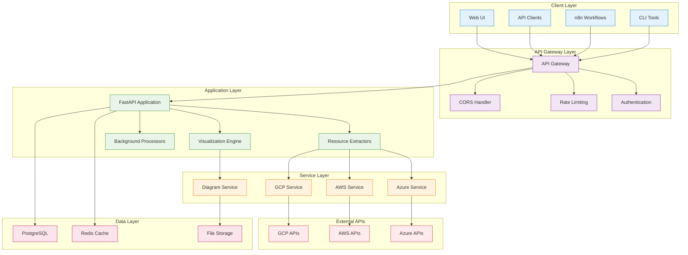
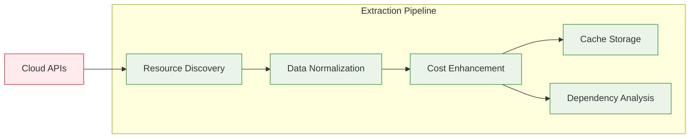
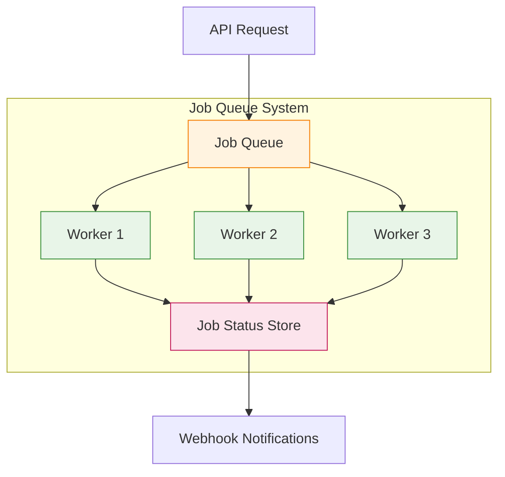
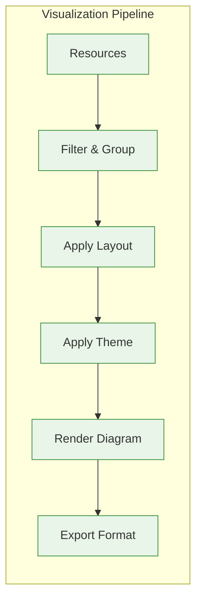

# CloudViz Architecture

This document describes the architectural design and technical implementation of CloudViz.

## 🏗️ System Overview

CloudViz is designed as a modern, cloud-native microservices architecture that provides scalable infrastructure visualization capabilities.



## 🔧 Core Components

### 1. FastAPI Application Core

The main application is built on FastAPI, providing:

- **High Performance**: Async/await support for concurrent operations
- **Type Safety**: Pydantic models for request/response validation
- **Auto Documentation**: OpenAPI/Swagger documentation generation
- **Dependency Injection**: Clean separation of concerns

```python
# Core application structure
cloudviz/
├── api/                    # REST API implementation
│   ├── main.py            # FastAPI application
│   ├── routes/            # API route handlers
│   ├── middleware/        # Custom middleware
│   └── dependencies.py    # Dependency injection
├── core/                  # Core business logic
│   ├── config.py         # Configuration management
│   ├── database.py       # Database connection
│   └── cache.py          # Caching layer
├── providers/             # Cloud provider integrations
│   ├── azure/            # Azure resource extraction
│   ├── aws/              # AWS resource extraction
│   └── gcp/              # GCP resource extraction
└── visualization/         # Diagram generation
    ├── mermaid.py        # Mermaid diagram generator
    ├── themes.py         # Visual themes
    └── layouts.py        # Layout algorithms
```

### 2. Resource Extraction Engine

The extraction engine discovers and processes cloud resources:



#### Extraction Process

1. **Discovery**: Parallel API calls to cloud providers
2. **Normalization**: Convert provider-specific data to common schema
3. **Enhancement**: Add cost, dependency, and metadata information
4. **Caching**: Store processed data for fast retrieval
5. **Analysis**: Identify relationships and dependencies

### 3. Visualization Engine

The visualization engine generates diagrams from discovered resources:

```python
class VisualizationEngine:
    """Core visualization engine for generating infrastructure diagrams."""
    
    def __init__(self):
        self.renderers = {
            'mermaid': MermaidRenderer(),
            'graphviz': GraphvizRenderer(),
            'd3': D3Renderer()
        }
        self.layouts = {
            'hierarchical': HierarchicalLayout(),
            'force': ForceDirectedLayout(),
            'circular': CircularLayout()
        }
    
    def generate_diagram(self, resources, format, layout, theme):
        """Generate diagram from resources."""
        # 1. Apply layout algorithm
        positioned_resources = self.layouts[layout].apply(resources)
        
        # 2. Render diagram
        renderer = self.renderers[format]
        diagram = renderer.render(positioned_resources, theme)
        
        # 3. Cache result
        self.cache.store(diagram_id, diagram)
        
        return diagram
```

### 4. Background Job System

Background jobs handle long-running operations:



## 📊 Data Models

### Core Data Schema

CloudViz uses a unified data model across all cloud providers:

```python
from pydantic import BaseModel
from typing import List, Dict, Optional
from datetime import datetime

class CloudResource(BaseModel):
    """Unified cloud resource model."""
    
    # Identity
    id: str
    name: str
    type: str
    provider: str  # azure, aws, gcp
    
    # Location
    region: str
    availability_zone: Optional[str]
    
    # Organization
    resource_group: Optional[str]  # Azure
    account_id: Optional[str]      # AWS
    project_id: Optional[str]      # GCP
    
    # Status
    state: str
    status: str
    
    # Cost Information
    cost_per_hour: Optional[float]
    cost_per_month: Optional[float]
    currency: str = "USD"
    
    # Metadata
    tags: Dict[str, str] = {}
    properties: Dict[str, Any] = {}
    
    # Relationships
    dependencies: List[str] = []
    dependents: List[str] = []
    
    # Timestamps
    created_at: datetime
    last_updated: datetime
    discovered_at: datetime

class InfrastructureDiagram(BaseModel):
    """Infrastructure diagram model."""
    
    id: str
    name: str
    format: str  # mermaid, graphviz, d3
    layout: str  # hierarchical, force, circular
    theme: str
    
    # Content
    diagram_code: str
    resource_count: int
    
    # Metadata
    providers: List[str]
    regions: List[str]
    cost_total: Optional[float]
    
    # Timestamps
    generated_at: datetime
    expires_at: Optional[datetime]
```

### Database Schema

CloudViz uses PostgreSQL with the following core tables:

```sql
-- Resources table
CREATE TABLE resources (
    id UUID PRIMARY KEY,
    name VARCHAR(255) NOT NULL,
    type VARCHAR(100) NOT NULL,
    provider VARCHAR(20) NOT NULL,
    region VARCHAR(50),
    resource_group VARCHAR(255),
    state VARCHAR(50),
    cost_per_month DECIMAL(10,2),
    tags JSONB,
    properties JSONB,
    created_at TIMESTAMP DEFAULT NOW(),
    updated_at TIMESTAMP DEFAULT NOW()
);

-- Resource dependencies
CREATE TABLE resource_dependencies (
    id UUID PRIMARY KEY,
    source_resource_id UUID REFERENCES resources(id),
    target_resource_id UUID REFERENCES resources(id),
    dependency_type VARCHAR(50),
    created_at TIMESTAMP DEFAULT NOW()
);

-- Diagrams table
CREATE TABLE diagrams (
    id UUID PRIMARY KEY,
    name VARCHAR(255),
    format VARCHAR(20),
    layout VARCHAR(50),
    theme VARCHAR(50),
    diagram_code TEXT,
    resource_count INTEGER,
    generated_at TIMESTAMP DEFAULT NOW(),
    expires_at TIMESTAMP
);

-- Jobs table
CREATE TABLE jobs (
    id UUID PRIMARY KEY,
    type VARCHAR(50) NOT NULL,
    status VARCHAR(20) DEFAULT 'pending',
    progress INTEGER DEFAULT 0,
    result JSONB,
    error_message TEXT,
    created_at TIMESTAMP DEFAULT NOW(),
    started_at TIMESTAMP,
    completed_at TIMESTAMP
);
```

## 🔌 Provider Architecture

Each cloud provider is implemented as a separate module with a common interface:

```python
from abc import ABC, abstractmethod
from typing import List, Dict, Any

class CloudProvider(ABC):
    """Abstract base class for cloud providers."""
    
    @abstractmethod
    async def authenticate(self) -> bool:
        """Authenticate with the cloud provider."""
        pass
    
    @abstractmethod
    async def discover_resources(self, filters: Dict[str, Any]) -> List[CloudResource]:
        """Discover resources in the cloud provider."""
        pass
    
    @abstractmethod
    async def get_cost_data(self, resource_ids: List[str]) -> Dict[str, float]:
        """Get cost data for resources."""
        pass
    
    @abstractmethod
    async def analyze_dependencies(self, resources: List[CloudResource]) -> Dict[str, List[str]]:
        """Analyze dependencies between resources."""
        pass

class AzureProvider(CloudProvider):
    """Azure cloud provider implementation."""
    
    def __init__(self, client_id: str, client_secret: str, tenant_id: str):
        self.client_id = client_id
        self.client_secret = client_secret
        self.tenant_id = tenant_id
        self.clients = {}
    
    async def authenticate(self) -> bool:
        """Authenticate with Azure using service principal."""
        try:
            credential = ClientSecretCredential(
                self.tenant_id, self.client_id, self.client_secret
            )
            # Initialize Azure clients
            self.clients['resource'] = ResourceManagementClient(credential, subscription_id)
            self.clients['compute'] = ComputeManagementClient(credential, subscription_id)
            return True
        except Exception as e:
            logger.error(f"Azure authentication failed: {e}")
            return False
```

## 🎨 Visualization Architecture

### Diagram Generation Pipeline



### Layout Algorithms

CloudViz supports multiple layout algorithms:

#### 1. Hierarchical Layout

```python
class HierarchicalLayout:
    """Hierarchical layout for infrastructure diagrams."""
    
    def apply(self, resources: List[CloudResource]) -> Dict[str, Any]:
        """Apply hierarchical layout to resources."""
        
        # Group resources by provider and region
        hierarchy = self._build_hierarchy(resources)
        
        # Position resources in hierarchy
        positioned = self._position_resources(hierarchy)
        
        return positioned
    
    def _build_hierarchy(self, resources):
        """Build resource hierarchy."""
        hierarchy = {
            'providers': {},
            'regions': {},
            'services': {}
        }
        
        for resource in resources:
            # Group by provider
            if resource.provider not in hierarchy['providers']:
                hierarchy['providers'][resource.provider] = []
            hierarchy['providers'][resource.provider].append(resource)
            
            # Group by region
            region_key = f"{resource.provider}:{resource.region}"
            if region_key not in hierarchy['regions']:
                hierarchy['regions'][region_key] = []
            hierarchy['regions'][region_key].append(resource)
        
        return hierarchy
```

#### 2. Force-Directed Layout

```python
class ForceDirectedLayout:
    """Force-directed layout for dependency visualization."""
    
    def apply(self, resources: List[CloudResource]) -> Dict[str, Any]:
        """Apply force-directed layout."""
        
        # Build graph from resources and dependencies
        graph = self._build_graph(resources)
        
        # Apply force simulation
        positions = self._simulate_forces(graph)
        
        return positions
```

### Theme System

CloudViz supports multiple visual themes:

```python
class ThemeManager:
    """Manages visual themes for diagrams."""
    
    THEMES = {
        'professional': {
            'colors': {
                'azure': '#0078d4',
                'aws': '#ff9900',
                'gcp': '#4285f4',
                'compute': '#9b59b6',
                'network': '#2ecc71',
                'storage': '#e74c3c',
                'database': '#f39c12'
            },
            'fonts': {
                'family': 'Arial, sans-serif',
                'size': '12px'
            }
        },
        'dark': {
            'colors': {
                'background': '#2c3e50',
                'text': '#ecf0f1',
                'azure': '#4fc3f7',
                'aws': '#ffb74d',
                'gcp': '#64b5f6'
            }
        }
    }
```

## ⚡ Performance Optimizations

### 1. Caching Strategy

CloudViz implements multi-layer caching:

```python
class CacheManager:
    """Multi-layer cache management."""
    
    def __init__(self):
        self.memory_cache = {}  # L1 cache
        self.redis_cache = redis.Redis()  # L2 cache
        self.file_cache = FileCache()  # L3 cache
    
    async def get(self, key: str) -> Optional[Any]:
        """Get value from cache with fallback."""
        
        # L1: Memory cache
        if key in self.memory_cache:
            return self.memory_cache[key]
        
        # L2: Redis cache
        value = await self.redis_cache.get(key)
        if value:
            self.memory_cache[key] = value
            return value
        
        # L3: File cache
        value = await self.file_cache.get(key)
        if value:
            await self.redis_cache.set(key, value, ex=3600)
            self.memory_cache[key] = value
            return value
        
        return None
```

### 2. Parallel Processing

Resource discovery is parallelized for performance:

```python
async def discover_all_resources(providers: List[CloudProvider]) -> List[CloudResource]:
    """Discover resources from all providers in parallel."""
    
    tasks = []
    for provider in providers:
        task = asyncio.create_task(provider.discover_resources({}))
        tasks.append(task)
    
    results = await asyncio.gather(*tasks, return_exceptions=True)
    
    all_resources = []
    for result in results:
        if isinstance(result, Exception):
            logger.error(f"Provider discovery failed: {result}")
        else:
            all_resources.extend(result)
    
    return all_resources
```

### 3. Database Optimizations

- **Connection Pooling**: Efficient database connection management
- **Query Optimization**: Indexed queries for fast resource lookup
- **Batch Operations**: Bulk inserts and updates
- **Read Replicas**: Separate read/write operations

## 🔒 Security Architecture

### 1. Authentication & Authorization

```python
class SecurityManager:
    """Handles authentication and authorization."""
    
    def __init__(self):
        self.jwt_secret = os.getenv('JWT_SECRET')
        self.api_keys = {}
        self.rbac = RoleBasedAccessControl()
    
    async def authenticate_request(self, request: Request) -> Optional[User]:
        """Authenticate incoming request."""
        
        # Check for API key
        api_key = request.headers.get('X-API-Key')
        if api_key and api_key in self.api_keys:
            return self.api_keys[api_key]['user']
        
        # Check for JWT token
        auth_header = request.headers.get('Authorization')
        if auth_header and auth_header.startswith('Bearer '):
            token = auth_header[7:]
            return await self.verify_jwt(token)
        
        return None
    
    async def authorize_action(self, user: User, action: str, resource: str) -> bool:
        """Check if user is authorized for action."""
        return self.rbac.check_permission(user, action, resource)
```

### 2. Data Protection

- **Encryption at Rest**: All sensitive data encrypted
- **Encryption in Transit**: TLS/SSL for all communications
- **Credential Management**: Secure storage of cloud credentials
- **Audit Logging**: Complete audit trail of all operations

## 📈 Scalability Considerations

### 1. Horizontal Scaling

CloudViz is designed for horizontal scaling:

- **Stateless Application**: No server-side session state
- **Load Balancing**: Multiple API instances behind load balancer
- **Database Scaling**: Read replicas and connection pooling
- **Cache Scaling**: Redis cluster for distributed caching

### 2. Vertical Scaling

Performance tuning options:

- **Worker Processes**: Configurable number of worker processes
- **Memory Allocation**: JVM-style memory management
- **CPU Optimization**: Multi-threading for I/O operations
- **Disk I/O**: SSD storage for better performance

### 3. Cloud-Native Deployment

```yaml
# Kubernetes deployment example
apiVersion: apps/v1
kind: Deployment
metadata:
  name: cloudviz
spec:
  replicas: 3
  selector:
    matchLabels:
      app: cloudviz
  template:
    metadata:
      labels:
        app: cloudviz
    spec:
      containers:
      - name: cloudviz
        image: cloudviz:latest
        ports:
        - containerPort: 8000
        env:
        - name: DATABASE_URL
          valueFrom:
            secretKeyRef:
              name: cloudviz-secrets
              key: database-url
        resources:
          requests:
            memory: "1Gi"
            cpu: "500m"
          limits:
            memory: "2Gi"
            cpu: "1000m"
```

## 🔧 Extension Points

CloudViz is designed for extensibility:

### 1. Custom Providers

Add new cloud providers by implementing the `CloudProvider` interface:

```python
class CustomCloudProvider(CloudProvider):
    """Custom cloud provider implementation."""
    
    async def discover_resources(self, filters):
        # Implement resource discovery
        pass
```

### 2. Custom Visualizations

Add new diagram formats:

```python
class CustomRenderer(DiagramRenderer):
    """Custom diagram renderer."""
    
    def render(self, resources, theme):
        # Implement custom rendering
        pass
```

### 3. Custom Layouts

Implement new layout algorithms:

```python
class CustomLayout(LayoutAlgorithm):
    """Custom layout algorithm."""
    
    def apply(self, resources):
        # Implement custom layout
        pass
```

## 📚 Technology Stack

### Core Technologies

- **Python 3.8+**: Main programming language
- **FastAPI**: Modern web framework
- **Pydantic**: Data validation and serialization
- **SQLAlchemy**: Database ORM
- **Alembic**: Database migrations

### Cloud SDKs

- **Azure SDK**: `azure-mgmt-*` packages
- **AWS SDK**: `boto3` and `botocore`
- **GCP SDK**: `google-cloud-*` packages

### Storage & Caching

- **PostgreSQL**: Primary database
- **Redis**: Caching and session storage
- **File System**: Diagram and asset storage

### Monitoring & Observability

- **Prometheus**: Metrics collection
- **Grafana**: Metrics visualization
- **Structlog**: Structured logging
- **Sentry**: Error tracking (optional)

---

This architecture provides a solid foundation for scalable, maintainable infrastructure visualization while remaining flexible for future enhancements and integrations.