# Multi-Cloud Setup Guide

This guide helps you configure CloudViz to work with multiple cloud providers simultaneously.

## 🌐 Overview

CloudViz can discover and visualize resources across Azure, AWS, and GCP in a single unified diagram. This multi-cloud approach provides:

- **Complete infrastructure visibility** across all cloud platforms
- **Unified cost analysis** and optimization opportunities
- **Cross-cloud dependency mapping** and security analysis
- **Consistent visualization** regardless of cloud provider

## 🔷 Azure Configuration

### 1. Service Principal Setup

Create a service principal with the necessary permissions:

```bash
# Create service principal
az ad sp create-for-rbac --name cloudviz-sp \
  --role Contributor \
  --scopes /subscriptions/{subscription-id}
```

Output:
```json
{
  "appId": "12345678-1234-1234-1234-123456789012",
  "displayName": "cloudviz-sp",
  "password": "your-client-secret",
  "tenant": "87654321-4321-4321-4321-210987654321"
}
```

### 2. Environment Variables

```bash
export AZURE_CLIENT_ID="12345678-1234-1234-1234-123456789012"
export AZURE_CLIENT_SECRET="your-client-secret"
export AZURE_TENANT_ID="87654321-4321-4321-4321-210987654321"
export AZURE_SUBSCRIPTION_ID="your-subscription-id"
```

### 3. Required Permissions

Grant the service principal these permissions:

- **Reader** role on subscriptions for resource discovery
- **Cost Management Reader** for cost data access
- **Network Contributor** for network topology mapping (optional)

### 4. Test Azure Connection

```bash
curl -X POST http://localhost:8000/api/v1/azure/test-connection \
  -H "Content-Type: application/json" \
  -d '{
    "subscription_id": "'$AZURE_SUBSCRIPTION_ID'"
  }'
```

## ☁️ AWS Configuration

### 1. IAM User Setup

Create an IAM user with programmatic access:

```bash
# Create IAM user
aws iam create-user --user-name cloudviz-user

# Create access keys
aws iam create-access-key --user-name cloudviz-user
```

### 2. IAM Policy

Create a custom policy or use managed policies:

```json
{
  "Version": "2012-10-17",
  "Statement": [
    {
      "Effect": "Allow",
      "Action": [
        "ec2:Describe*",
        "rds:Describe*",
        "s3:ListBucket",
        "s3:GetBucketLocation",
        "lambda:List*",
        "ecs:Describe*",
        "eks:Describe*",
        "cloudformation:Describe*",
        "cost-explorer:Get*",
        "pricing:Get*"
      ],
      "Resource": "*"
    }
  ]
}
```

Or use managed policies:
```bash
# Attach ReadOnlyAccess policy
aws iam attach-user-policy --user-name cloudviz-user \
  --policy-arn arn:aws:iam::aws:policy/ReadOnlyAccess

# Attach Cost Explorer access
aws iam attach-user-policy --user-name cloudviz-user \
  --policy-arn arn:aws:iam::aws:policy/AWSBillingReadOnlyAccess
```

### 3. Environment Variables

```bash
export AWS_ACCESS_KEY_ID="your-access-key-id"
export AWS_SECRET_ACCESS_KEY="your-secret-access-key"
export AWS_DEFAULT_REGION="ap-southeast-2"
```

### 4. Test AWS Connection

```bash
curl -X POST http://localhost:8000/api/v1/aws/test-connection \
  -H "Content-Type: application/json"
```

## 🔵 GCP Configuration

### 1. Service Account Setup

Create a service account with the necessary roles:

```bash
# Create service account
gcloud iam service-accounts create cloudviz-sa \
  --description="CloudViz Service Account" \
  --display-name="CloudViz"

# Grant roles
gcloud projects add-iam-policy-binding your-project-id \
  --member="serviceAccount:cloudviz-sa@your-project-id.iam.gserviceaccount.com" \
  --role="roles/viewer"

gcloud projects add-iam-policy-binding your-project-id \
  --member="serviceAccount:cloudviz-sa@your-project-id.iam.gserviceaccount.com" \
  --role="roles/billing.viewer"

# Create and download key
gcloud iam service-accounts keys create cloudviz-key.json \
  --iam-account=cloudviz-sa@your-project-id.iam.gserviceaccount.com
```

### 2. Environment Variables

```bash
export GOOGLE_APPLICATION_CREDENTIALS="/path/to/cloudviz-key.json"
export GCP_PROJECT_ID="your-project-id"
```

### 3. Required Roles

Grant these roles to the service account:

- **Viewer** - Basic resource read access
- **Billing Account Viewer** - Cost data access
- **Compute Viewer** - Detailed compute resource information
- **Storage Object Viewer** - Storage resource information

### 4. Test GCP Connection

```bash
curl -X POST http://localhost:8000/api/v1/gcp/test-connection \
  -H "Content-Type: application/json" \
  -d '{
    "project_id": "'$GCP_PROJECT_ID'"
  }'
```

## ⚙️ Multi-Cloud Configuration

### 1. Configuration File

Create a comprehensive configuration file:

```yaml
# config/multi-cloud.yml
cloud_providers:
  azure:
    enabled: true
    subscriptions:
      - id: "12345678-1234-1234-1234-123456789012"
        name: "Production"
        regions: ["australiaeast", "australiasoutheast"]
        resource_groups: ["production", "staging"]
      - id: "87654321-4321-4321-4321-210987654321"
        name: "Development"
        regions: ["australiaeast"]
        resource_groups: ["development"]
    
  aws:
    enabled: true
    accounts:
      - id: "123456789012"
        name: "Production"
        regions: ["ap-southeast-2", "us-east-1"]
      - id: "210987654321"
        name: "Development"
        regions: ["ap-southeast-2"]
    
  gcp:
    enabled: true
    projects:
      - id: "production-project"
        name: "Production Environment"
        regions: ["australia-southeast1", "us-central1"]
      - id: "development-project"
        name: "Development Environment"
        regions: ["australia-southeast1"]

discovery:
  parallel_execution: true
  timeout: 600
  batch_size: 100
  include_costs: true
  include_dependencies: true

visualization:
  multi_cloud_layout: "hierarchical"
  show_cross_cloud_connections: true
  group_by_environment: true
  color_by_provider: true
```

### 2. Environment Setup

Create a comprehensive environment file:

```bash
# .env.multi-cloud
# Azure
AZURE_CLIENT_ID=12345678-1234-1234-1234-123456789012
AZURE_CLIENT_SECRET=your-azure-secret
AZURE_TENANT_ID=87654321-4321-4321-4321-210987654321

# AWS
AWS_ACCESS_KEY_ID=your-aws-access-key
AWS_SECRET_ACCESS_KEY=your-aws-secret-key
AWS_DEFAULT_REGION=ap-southeast-2

# GCP
GOOGLE_APPLICATION_CREDENTIALS=/path/to/gcp-key.json
GCP_PROJECT_ID=your-gcp-project

# CloudViz
CLOUDVIZ_CONFIG_FILE=config/multi-cloud.yml
CLOUDVIZ_WORKERS=8
CLOUDVIZ_CACHE_ENABLED=true
```

## 🔄 Multi-Cloud Discovery

### 1. Comprehensive Discovery

Discover resources across all cloud providers:

```bash
curl -X POST http://localhost:8000/api/v1/multi-cloud/extract \
  -H "Content-Type: application/json" \
  -d '{
    "providers": ["azure", "aws", "gcp"],
    "parallel": true,
    "include_costs": true,
    "webhook_url": "http://your-webhook.com/multi-cloud-complete"
  }'
```

### 2. Provider-Specific Discovery

Extract from individual providers with consistent parameters:

```bash
# Azure
curl -X POST http://localhost:8000/api/v1/azure/extract \
  -H "Content-Type: application/json" \
  -d '{
    "subscription_id": "'$AZURE_SUBSCRIPTION_ID'",
    "resource_groups": ["production", "staging"],
    "include_costs": true
  }'

# AWS
curl -X POST http://localhost:8000/api/v1/aws/extract \
  -H "Content-Type: application/json" \
  -d '{
    "account_id": "123456789012",
    "regions": ["ap-southeast-2", "us-east-1"],
    "include_costs": true
  }'

# GCP
curl -X POST http://localhost:8000/api/v1/gcp/extract \
  -H "Content-Type: application/json" \
  -d '{
    "project_id": "'$GCP_PROJECT_ID'",
    "regions": ["australia-southeast1", "us-central1"],
    "include_costs": true
  }'
```

## 🎨 Multi-Cloud Visualization

### 1. Unified Diagram Generation

Create a comprehensive multi-cloud diagram:

```bash
curl -X POST http://localhost:8000/api/v1/visualization/generate \
  -H "Content-Type: application/json" \
  -d '{
    "providers": ["azure", "aws", "gcp"],
    "format": "mermaid",
    "layout": "hierarchical",
    "include_costs": true,
    "include_dependencies": true,
    "theme": "multi-cloud",
    "grouping": {
      "by_provider": true,
      "by_region": true,
      "by_environment": true
    }
  }'
```

### 2. Cross-Cloud Dependency Mapping

Visualize connections between cloud providers:

```bash
curl -X POST http://localhost:8000/api/v1/visualization/generate \
  -H "Content-Type: application/json" \
  -d '{
    "providers": ["azure", "aws", "gcp"],
    "format": "mermaid",
    "layout": "network",
    "focus": "dependencies",
    "show_cross_provider_connections": true,
    "include_network_flows": true
  }'
```

### 3. Cost Comparison Visualization

Compare costs across cloud providers:

```bash
curl -X POST http://localhost:8000/api/v1/visualization/generate \
  -H "Content-Type: application/json" \
  -d '{
    "providers": ["azure", "aws", "gcp"],
    "format": "mermaid",
    "layout": "cost_analysis",
    "include_costs": true,
    "cost_breakdown": {
      "by_provider": true,
      "by_service": true,
      "by_region": true
    }
  }'
```

## 📊 Example Multi-Cloud Diagram

Here's what a multi-cloud infrastructure diagram looks like:

```mermaid
flowchart TD
    subgraph INTERNET["🌍 Internet"]
        USERS["👥 Global Users"]
    end
    
    subgraph AZURE["🔷 Azure Production"]
        subgraph AZ_AU_EAST["🌏 Australia East"]
            AZ_CDN["🚀 Azure CDN<br/>$198/month"]
            AZ_APPGW["🌐 Application Gateway<br/>$378/month"]
            AZ_VMSS["🔄 Web VMSS<br/>$1,234/month"]
            AZ_SQL["🗄️ SQL Database<br/>$2,456/month"]
        end
    end
    
    subgraph AWS["🟠 AWS Production"]
        subgraph AWS_AP_SE_2["🌏 AP-Southeast-2"]
            AWS_CF["🚀 CloudFront<br/>$567/month"]
            AWS_ALB["⚖️ Application LB<br/>$345/month"]
            AWS_EC2["🖥️ EC2 Instances<br/>$1,456/month"]
            AWS_RDS["🗄️ RDS Aurora<br/>$2,890/month"]
        end
    end
    
    subgraph GCP["🔵 GCP Production"]
        subgraph GCP_AU_SE_1["🌏 australia-southeast1"]
            GCP_CDN["🚀 Cloud CDN<br/>$156/month"]
            GCP_LB["⚖️ Global LB<br/>$234/month"]
            GCP_GKE["⚙️ GKE Cluster<br/>$3,456/month"]
            GCP_SQL["🗄️ Cloud SQL<br/>$4,123/month"]
        end
    end
    
    %% Traffic Flow
    USERS --> AZ_CDN
    USERS --> AWS_CF
    USERS --> GCP_CDN
    
    %% Azure Flow
    AZ_CDN --> AZ_APPGW
    AZ_APPGW --> AZ_VMSS
    AZ_VMSS --> AZ_SQL
    
    %% AWS Flow
    AWS_CF --> AWS_ALB
    AWS_ALB --> AWS_EC2
    AWS_EC2 --> AWS_RDS
    
    %% GCP Flow
    GCP_CDN --> GCP_LB
    GCP_LB --> GCP_GKE
    GCP_GKE --> GCP_SQL
    
    %% Cross-Cloud Connections
    AZ_SQL -.-> AWS_RDS
    AWS_RDS -.-> GCP_SQL
    
    classDef azure fill:#0078d4,stroke:#106ebe,color:#fff
    classDef aws fill:#ff9900,stroke:#cc7a00,color:#fff
    classDef gcp fill:#4285f4,stroke:#1a73e8,color:#fff
    classDef internet fill:#34495e,stroke:#2c3e50,color:#fff
    
    class AZURE,AZ_CDN,AZ_APPGW,AZ_VMSS,AZ_SQL azure
    class AWS,AWS_CF,AWS_ALB,AWS_EC2,AWS_RDS aws
    class GCP,GCP_CDN,GCP_LB,GCP_GKE,GCP_SQL gcp
    class INTERNET,USERS internet
```



## 🔗 Cross-Cloud Integrations

### 1. Network Connectivity

Map network connections between cloud providers:

- **VPN Connections**: Site-to-site VPNs between clouds
- **ExpressRoute/Direct Connect**: Dedicated connections
- **VPC Peering**: Cross-cloud network peering
- **Private Endpoints**: Secure service connections

### 2. Data Synchronization

Visualize data flows across clouds:

- **Database Replication**: Cross-cloud database replicas
- **Storage Sync**: File and object storage synchronization
- **Message Queues**: Cross-cloud messaging systems
- **ETL Pipelines**: Data processing across providers

### 3. Security Integrations

Map security controls across clouds:

- **Identity Federation**: Single sign-on across clouds
- **Security Groups**: Firewall rules and network security
- **Key Management**: Cross-cloud encryption keys
- **Audit Logging**: Centralized security monitoring

## 📈 Cost Optimization

### 1. Multi-Cloud Cost Analysis

Compare costs across providers:

```bash
curl -X GET http://localhost:8000/api/v1/analytics/cost-comparison \
  -H "Content-Type: application/json" \
  -d '{
    "providers": ["azure", "aws", "gcp"],
    "timeframe": "monthly",
    "breakdown": ["provider", "service", "region"]
  }'
```

### 2. Resource Optimization

Identify optimization opportunities:

- **Right-sizing**: Compare instance types across providers
- **Reserved Instances**: Analyze reservation opportunities
- **Spot/Preemptible**: Identify workloads for cheaper instances
- **Storage Classes**: Optimize storage tier selection

### 3. Cost Alerts

Set up cross-cloud cost monitoring:

```yaml
cost_alerts:
  total_monthly_threshold: 10000
  provider_thresholds:
    azure: 4000
    aws: 3500
    gcp: 2500
  anomaly_detection: true
  notification_channels:
    - slack
    - email
```

## 🔧 Best Practices

### 1. Credential Management

- **Separate credentials** for each environment
- **Rotate credentials** regularly
- **Use least privilege** access principles
- **Monitor credential usage** with audit logs

### 2. Discovery Strategy

- **Parallel discovery** for faster scanning
- **Region-specific** scans for large infrastructures
- **Resource filtering** for focused analysis
- **Scheduled scans** for change tracking

### 3. Visualization Organization

- **Environment separation** (prod, staging, dev)
- **Application grouping** for business context
- **Cost-based views** for financial analysis
- **Security-focused** diagrams for compliance

### 4. Automation Integration

- **n8n workflows** for automated discovery
- **CI/CD integration** for infrastructure validation
- **Alerting systems** for change notifications
- **Reporting automation** for regular updates

## 🚨 Troubleshooting

### Common Issues

1. **Credential conflicts**: Ensure each provider's credentials are correctly set
2. **Permission errors**: Verify all required roles and permissions
3. **Network timeouts**: Increase timeout values for large infrastructures
4. **Rate limiting**: Implement backoff strategies for API calls

### Debugging Multi-Cloud Setup

```bash
# Test each provider individually
curl http://localhost:8000/api/v1/azure/test-connection
curl http://localhost:8000/api/v1/aws/test-connection
curl http://localhost:8000/api/v1/gcp/test-connection

# Check discovery status
curl http://localhost:8000/api/v1/admin/jobs

# View provider-specific resources
curl http://localhost:8000/api/v1/resources?provider=azure
curl http://localhost:8000/api/v1/resources?provider=aws
curl http://localhost:8000/api/v1/resources?provider=gcp
```

---

## 🎯 Next Steps

Once you have multi-cloud setup working:

1. **Explore automation**: Set up automated multi-cloud discovery
2. **Cost monitoring**: Implement cross-cloud cost alerts
3. **Security analysis**: Map security controls across providers
4. **Compliance reporting**: Generate compliance reports across clouds

For more advanced features, see:
- [Visualization Guide](visualization.md)
- [n8n Integration](n8n-integration.md)
- [Cost Analytics](cost-analytics.md)