# Quick Start Guide

Get CloudViz up and running in 5 minutes! This guide will help you deploy CloudViz and generate your first infrastructure diagram.

## 🎯 Prerequisites

- Docker and Docker Compose installed
- Azure, AWS, or GCP account with appropriate permissions
- 10 minutes of your time

## 🚀 1. Quick Deploy

```bash
# Clone and start CloudViz
git clone https://github.com/navidrast/cloudviz.git
cd cloudviz
docker-compose up -d

# Verify it's running
curl http://localhost:8000/health
```

Expected response:
```json
{
  "status": "healthy",
  "version": "1.0.0"
}
```

## 🔐 2. Configure Cloud Access

Choose your cloud provider and set up credentials:

### Option A: Azure
```bash
# Set Azure credentials
export AZURE_CLIENT_ID=your-client-id
export AZURE_CLIENT_SECRET=your-client-secret
export AZURE_TENANT_ID=your-tenant-id
export AZURE_SUBSCRIPTION_ID=your-subscription-id

# Test connection
curl -X POST http://localhost:8000/api/v1/azure/test-connection \
  -H "Content-Type: application/json" \
  -d '{"subscription_id": "'$AZURE_SUBSCRIPTION_ID'"}'
```

### Option B: AWS
```bash
# Set AWS credentials
export AWS_ACCESS_KEY_ID=your-access-key
export AWS_SECRET_ACCESS_KEY=your-secret-key
export AWS_DEFAULT_REGION=ap-southeast-2

# Test connection
curl -X POST http://localhost:8000/api/v1/aws/test-connection
```

### Option C: GCP
```bash
# Set GCP credentials
export GOOGLE_APPLICATION_CREDENTIALS=path/to/service-account.json
export GCP_PROJECT_ID=your-project-id

# Test connection
curl -X POST http://localhost:8000/api/v1/gcp/test-connection \
  -H "Content-Type: application/json" \
  -d '{"project_id": "'$GCP_PROJECT_ID'"}'
```

## 📊 3. Discover Resources

Extract resources from your cloud environment:

### Azure Example
```bash
curl -X POST http://localhost:8000/api/v1/azure/extract \
  -H "Content-Type: application/json" \
  -d '{
    "subscription_id": "'$AZURE_SUBSCRIPTION_ID'",
    "resource_groups": ["production", "staging"],
    "include_costs": true
  }'
```

### AWS Example
```bash
curl -X POST http://localhost:8000/api/v1/aws/extract \
  -H "Content-Type: application/json" \
  -d '{
    "account_id": "123456789012",
    "regions": ["ap-southeast-2", "us-east-1"],
    "include_costs": true
  }'
```

### GCP Example
```bash
curl -X POST http://localhost:8000/api/v1/gcp/extract \
  -H "Content-Type: application/json" \
  -d '{
    "project_id": "'$GCP_PROJECT_ID'",
    "regions": ["australia-southeast1"],
    "include_costs": true
  }'
```

Expected response:
```json
{
  "job_id": "azure-job-456",
  "status": "started",
  "estimated_duration": 300
}
```

## 🎨 4. Generate Your First Diagram

Create a beautiful infrastructure visualization:

```bash
curl -X POST http://localhost:8000/api/v1/visualization/generate \
  -H "Content-Type: application/json" \
  -d '{
    "providers": ["azure"],
    "format": "mermaid",
    "layout": "hierarchical",
    "include_costs": true,
    "include_dependencies": true
  }'
```

Response:
```json
{
  "diagram_id": "diagram-abc123",
  "format": "mermaid",
  "resource_count": 25,
  "diagram_code": "flowchart TD\n  subgraph azure[\"Azure\"]\n    vm1[\"web-server-01\"]\n  end"
}
```

## 📁 5. View and Export

Get your diagram in different formats:

```bash
# View Mermaid code
curl http://localhost:8000/api/v1/visualization/export/diagram-abc123?format=mermaid

# Download as PNG
curl http://localhost:8000/api/v1/visualization/export/diagram-abc123?format=png -o diagram.png

# Download as SVG
curl http://localhost:8000/api/v1/visualization/export/diagram-abc123?format=svg -o diagram.svg
```

## 🌐 6. View in Browser

Open your browser and go to:

- **API Documentation**: http://localhost:8000/docs
- **Health Check**: http://localhost:8000/health
- **Interactive API**: http://localhost:8000/redoc

## 🔄 7. Set Up Automation (Optional)

Create an automated workflow with n8n:

```bash
# Download example workflow
curl -O https://raw.githubusercontent.com/navidrast/cloudviz/main/examples/n8n-workflows/daily-infrastructure-discovery.json

# Import into your n8n instance
# Visit your n8n dashboard and import the workflow
```

## 📊 Example Output

Your first diagram might look like this:

```mermaid
flowchart TD
    subgraph azure["🔷 Azure Production"]
        subgraph rg1["📦 Production RG"]
            vm1["🖥️ web-server-01<br/>Standard_D2s_v3<br/>$156/month"]
            lb1["⚖️ prod-loadbalancer<br/>Standard LB<br/>$18/month"]
            db1["🗄️ customer-database<br/>SQL Database<br/>$245/month"]
        end
        
        subgraph network["🌐 Network"]
            vnet1["🔗 prod-vnet<br/>10.0.0.0/16"]
            nsg1["🛡️ web-tier-nsg<br/>Security Group"]
        end
    end
    
    lb1 --> vm1
    vm1 --> db1
    vnet1 --> vm1
    nsg1 --> vm1
    
    classDef azure fill:#0078d4,stroke:#106ebe,color:#fff
    classDef compute fill:#9b59b6,stroke:#8e44ad,color:#fff
    classDef network fill:#2ecc71,stroke:#27ae60,color:#fff
    classDef database fill:#e74c3c,stroke:#c0392b,color:#fff
    
    class azure azure
    class vm1 compute
    class vnet1,nsg1,lb1 network
    class db1 database
```



## 🎉 Success! What's Next?

Congratulations! You've successfully:
- ✅ Deployed CloudViz
- ✅ Connected to your cloud provider
- ✅ Discovered infrastructure resources
- ✅ Generated your first diagram

### Next Steps:

1. **Explore More Features**:
   - [Multi-Cloud Setup](guides/multi-cloud-setup.md) - Connect multiple cloud providers
   - [Custom Visualizations](guides/visualization.md) - Customize diagram themes and layouts

2. **Set Up Automation**:
   - [n8n Integration](guides/n8n-integration.md) - Automate diagram generation
   - [CI/CD Integration](guides/cicd-integration.md) - Include in your deployment pipeline

3. **Production Deployment**:
   - [Production Setup](deployment/production.md) - Deploy for production use
   - [Security Guide](security/README.md) - Secure your CloudViz instance

4. **Advanced Features**:
   - [Cost Analytics](guides/cost-analytics.md) - Analyze cloud costs
   - [Dependency Mapping](guides/dependency-mapping.md) - Map service dependencies

## 🆘 Need Help?

If you run into issues:

1. **Check the logs**:
   ```bash
   docker-compose logs cloudviz
   ```

2. **Common Issues**:
   - Port 8000 already in use → Change port in docker-compose.yml
   - Authentication errors → Verify your cloud credentials
   - Permission errors → Check your cloud provider permissions

3. **Get Support**:
   - [Troubleshooting Guide](operations/troubleshooting.md)
   - [GitHub Issues](https://github.com/navidrast/cloudviz/issues)
   - [FAQ](reference/faq.md)

## 🎯 Pro Tips

- **Start Small**: Begin with one resource group or region
- **Use Filters**: Filter by tags or resource types for focused diagrams
- **Schedule Regular Scans**: Set up automated daily infrastructure discovery
- **Share Diagrams**: Export diagrams to share with your team
- **Monitor Changes**: Track infrastructure changes over time

---

**Ready to explore?** Check out the [full documentation](README.md) for advanced features and configuration options!