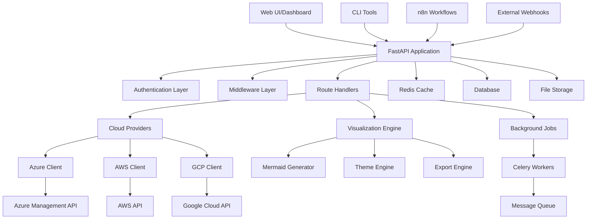
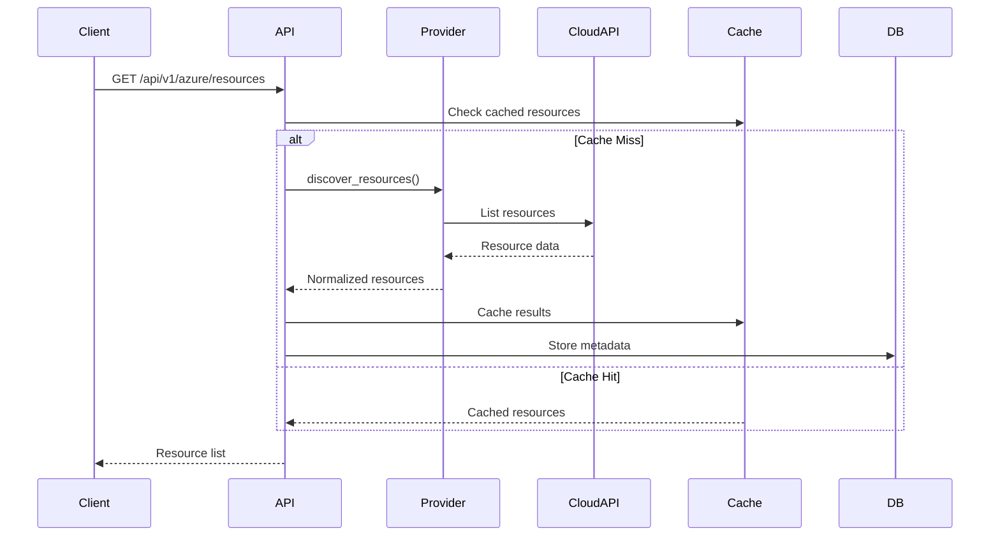
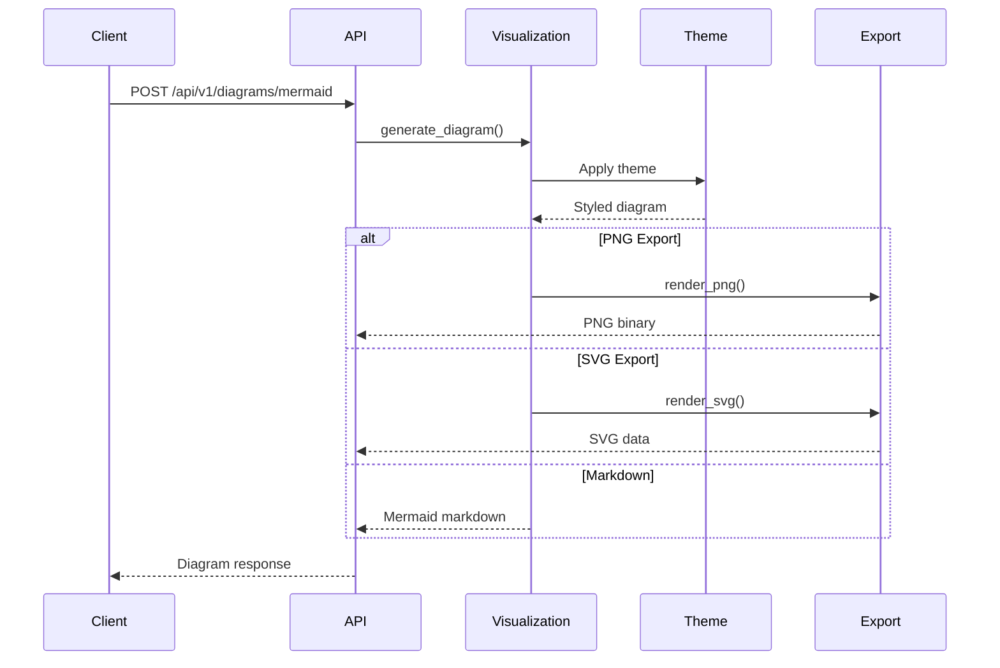
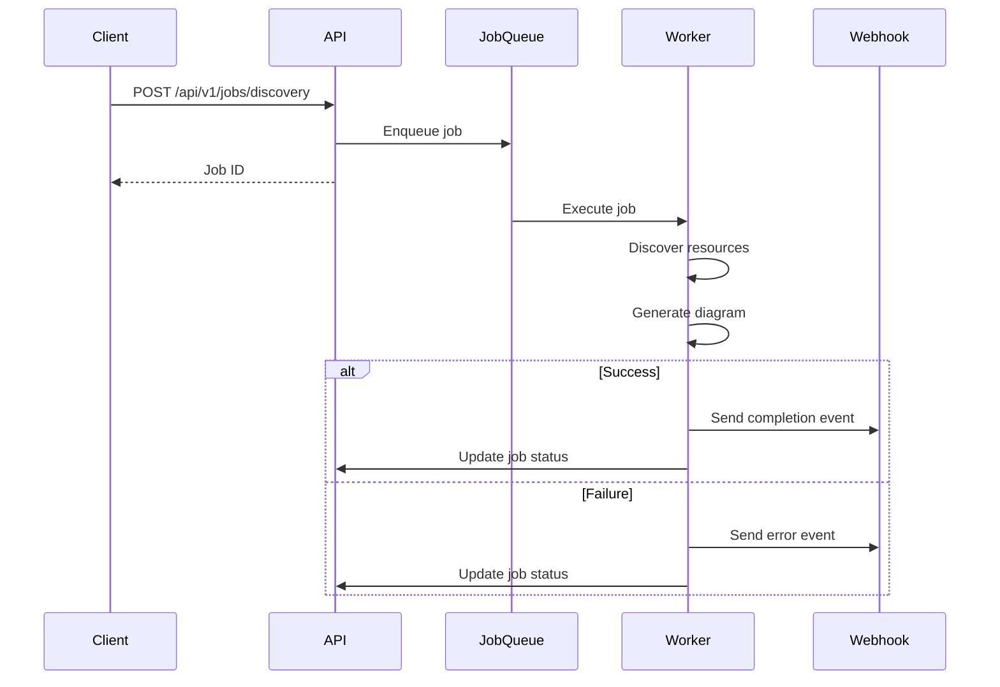

# Architecture

CloudViz is designed as a modern, scalable, enterprise-grade platform for multi-cloud infrastructure visualization. This document outlines the system architecture, components, design principles, and data flow.

## 🏗️ System Overview



## 🎯 Design Principles

### 1. **API-First Architecture**
- RESTful API design with OpenAPI specification
- Consistent request/response patterns
- Comprehensive error handling and validation
- Interactive documentation with Swagger/ReDoc

### 2. **Modular Component Design**
- Loosely coupled, highly cohesive components
- Plugin-based cloud provider architecture
- Extensible visualization themes and layouts
- Clear separation of concerns

### 3. **Enterprise Security**
- JWT-based authentication and authorization
- Role-based access control (RBAC)
- Secure credential management
- Audit logging and compliance tracking

### 4. **Scalability & Performance**
- Asynchronous processing with background jobs
- Redis caching for improved performance
- Horizontal scaling support
- Rate limiting and resource protection

### 5. **Multi-Cloud Abstraction**
- Unified interface across cloud providers
- Consistent resource modeling
- Standardized dependency mapping
- Provider-agnostic visualization

## 🔧 Core Components

### API Layer (`cloudviz/api/`)

The FastAPI-based REST API provides the primary interface for all CloudViz functionality.

#### Main Application (`main.py`)
```python
from fastapi import FastAPI
from cloudviz.api.middleware import setup_middleware
from cloudviz.api.routes import setup_routes
from cloudviz.core.config import get_settings

app = FastAPI(
    title="CloudViz API",
    description="Multi-cloud infrastructure visualization",
    version="1.0.0"
)

setup_middleware(app)
setup_routes(app)
```

#### Route Structure
```
/api/v1/
├── auth/              # Authentication endpoints
├── system/            # System health and metrics
├── providers/         # Cloud provider management
├── azure/             # Azure-specific endpoints
├── aws/               # AWS-specific endpoints (planned)
├── gcp/               # GCP-specific endpoints (planned)
├── diagrams/          # Visualization generation
├── jobs/              # Background job management
├── webhooks/          # Webhook management
├── config/            # Configuration management
└── analytics/         # Analytics and reporting
```

#### Middleware Stack
```python
# Security Middleware
app.add_middleware(SecurityHeadersMiddleware)
app.add_middleware(CORSMiddleware)

# Performance Middleware  
app.add_middleware(CompressionMiddleware)
app.add_middleware(CacheMiddleware)

# Monitoring Middleware
app.add_middleware(MetricsMiddleware)
app.add_middleware(RequestLoggingMiddleware)

# Error Handling
app.add_middleware(ErrorHandlingMiddleware)
```

### Core Layer (`cloudviz/core/`)

Provides foundational services and utilities used across the application.

#### Configuration Management (`config.py`)
```python
from pydantic import BaseSettings
from typing import List, Optional

class CloudVizSettings(BaseSettings):
    # API Configuration
    api_host: str = "0.0.0.0"
    api_port: int = 8000
    api_workers: int = 4
    
    # Security
    jwt_secret_key: str
    jwt_algorithm: str = "HS256"
    jwt_expiration: int = 3600
    
    # Cloud Providers
    azure_client_id: Optional[str] = None
    azure_client_secret: Optional[str] = None
    azure_tenant_id: Optional[str] = None
    
    # Cache & Storage
    redis_url: str = "redis://localhost:6379"
    database_url: str = "sqlite:///cloudviz.db"
    
    class Config:
        env_file = ".env"
```

#### Base Models (`models.py`)
```python
from pydantic import BaseModel
from typing import Dict, List, Optional
from datetime import datetime

class CloudResource(BaseModel):
    id: str
    name: str
    type: str
    provider: str
    region: str
    resource_group: Optional[str] = None
    subscription_id: Optional[str] = None
    properties: Dict = {}
    tags: Dict = {}
    dependencies: List[str] = []
    cost: Optional[float] = None

class DiagramRequest(BaseModel):
    resources: List[CloudResource]
    theme: str = "enterprise"
    layout: str = "hierarchical"
    include_costs: bool = True
    include_dependencies: bool = True
    filters: Optional[Dict] = None
```

#### Utilities (`utils/`)
- **Logging**: Structured logging with correlation IDs
- **Encryption**: Secure credential storage and retrieval
- **Validation**: Input validation and sanitization
- **Caching**: Redis-based caching utilities

### Cloud Providers Layer (`cloudviz/providers/`)

Abstracts cloud provider APIs into a unified interface.

#### Base Provider Interface
```python
from abc import ABC, abstractmethod
from typing import List, Dict, Optional

class CloudProvider(ABC):
    
    @abstractmethod
    async def authenticate(self) -> bool:
        """Authenticate with the cloud provider."""
        pass
    
    @abstractmethod
    async def discover_resources(
        self, 
        filters: Optional[Dict] = None
    ) -> List[CloudResource]:
        """Discover cloud resources."""
        pass
    
    @abstractmethod
    async def get_resource_dependencies(
        self, 
        resource_id: str
    ) -> List[str]:
        """Get resource dependencies."""
        pass
    
    @abstractmethod
    async def get_network_topology(
        self, 
        filters: Optional[Dict] = None
    ) -> Dict:
        """Get network topology information."""
        pass
```

#### Azure Provider (`azure/`)
```python
from azure.identity import ClientSecretCredential
from azure.mgmt.resource import ResourceManagementClient
from azure.mgmt.compute import ComputeManagementClient
from azure.mgmt.network import NetworkManagementClient

class AzureProvider(CloudProvider):
    
    def __init__(self, client_id: str, client_secret: str, tenant_id: str):
        self.credential = ClientSecretCredential(
            tenant_id=tenant_id,
            client_id=client_id,
            client_secret=client_secret
        )
        
    async def discover_resources(self, filters=None):
        # Implementation for Azure resource discovery
        pass
```

#### Resource Mapping
Each provider maps cloud-specific resources to the unified CloudResource model:

```python
# Azure Resource Mapping
AZURE_RESOURCE_MAPPINGS = {
    "Microsoft.Compute/virtualMachines": {
        "category": "compute",
        "icon": "🖥️",
        "properties": ["vm_size", "os_type", "power_state"]
    },
    "Microsoft.Network/virtualNetworks": {
        "category": "network", 
        "icon": "🌐",
        "properties": ["address_space", "subnets"]
    },
    "Microsoft.Storage/storageAccounts": {
        "category": "storage",
        "icon": "💾", 
        "properties": ["account_type", "replication"]
    }
}
```

### Visualization Engine (`cloudviz/visualization/`)

Generates diagrams and visualizations from cloud resource data.

#### Mermaid Generator (`mermaid/`)
```python
class MermaidGenerator:
    
    def __init__(self, theme: str = "enterprise"):
        self.theme = theme
        self.theme_config = self._load_theme(theme)
    
    def generate_diagram(
        self, 
        resources: List[CloudResource],
        layout: str = "hierarchical"
    ) -> str:
        """Generate Mermaid diagram from resources."""
        
        if layout == "hierarchical":
            return self._generate_hierarchical(resources)
        elif layout == "network":
            return self._generate_network_topology(resources)
        elif layout == "flat":
            return self._generate_flat_layout(resources)
    
    def _generate_hierarchical(self, resources):
        """Generate hierarchical flowchart."""
        diagram = ["flowchart TD"]
        
        # Group resources by hierarchy
        hierarchy = self._build_hierarchy(resources)
        
        # Generate nodes and edges
        for level, groups in hierarchy.items():
            diagram.extend(self._generate_level_nodes(groups))
            
        return "\n".join(diagram)
```

#### Theme System
```python
THEMES = {
    "enterprise": {
        "colors": {
            "compute": "#9b59b6",
            "network": "#3498db", 
            "storage": "#e67e22",
            "security": "#e74c3c",
            "management": "#27ae60"
        },
        "styles": {
            "node_shape": "rounded",
            "edge_style": "solid",
            "font_size": "12px"
        }
    },
    "security": {
        "colors": {
            "secure": "#27ae60",
            "warning": "#f39c12",
            "critical": "#e74c3c",
            "unknown": "#95a5a6"
        }
    }
}
```

#### Export Engine
- **PNG Export**: Using mermaid-cli or puppeteer
- **SVG Export**: Vector graphics for scalable diagrams
- **PDF Export**: Multi-page documentation format
- **Markdown Export**: Embedded diagrams in documentation

## 🔄 Data Flow

### 1. **Resource Discovery Flow**



### 2. **Diagram Generation Flow**



### 3. **Background Job Flow**



## 💾 Data Storage

### 1. **Primary Database**
- **SQLite**: Development and small deployments
- **PostgreSQL**: Production deployments
- **Schema**: Jobs, webhooks, audit logs, configuration

```sql
-- Job tracking
CREATE TABLE jobs (
    id UUID PRIMARY KEY,
    type VARCHAR(50) NOT NULL,
    status VARCHAR(20) NOT NULL,
    payload JSONB,
    result JSONB,
    created_at TIMESTAMP DEFAULT NOW(),
    completed_at TIMESTAMP
);

-- Webhook registrations
CREATE TABLE webhooks (
    id UUID PRIMARY KEY,
    url VARCHAR(500) NOT NULL,
    events TEXT[] NOT NULL,
    secret VARCHAR(100),
    active BOOLEAN DEFAULT TRUE,
    created_at TIMESTAMP DEFAULT NOW()
);

-- Audit logs
CREATE TABLE audit_logs (
    id UUID PRIMARY KEY,
    user_id VARCHAR(100),
    action VARCHAR(100) NOT NULL,
    resource_type VARCHAR(100),
    resource_id VARCHAR(200),
    details JSONB,
    timestamp TIMESTAMP DEFAULT NOW()
);
```

### 2. **Cache Layer (Redis)**
- **Resource Cache**: TTL-based caching of discovered resources
- **Session Storage**: JWT token blacklist, user sessions
- **Rate Limiting**: API rate limit counters
- **Job Queue**: Background job processing

```python
# Cache structure
CACHE_KEYS = {
    "resources": "cloudviz:resources:{provider}:{subscription}:{hash}",
    "diagrams": "cloudviz:diagrams:{hash}",
    "auth": "cloudviz:auth:{user_id}",
    "rate_limit": "cloudviz:rate:{endpoint}:{user_id}"
}

# TTL settings
CACHE_TTL = {
    "resources": 3600,      # 1 hour
    "diagrams": 7200,       # 2 hours  
    "auth": 86400,          # 24 hours
    "rate_limit": 60        # 1 minute
}
```

### 3. **File Storage**
- **Local Storage**: Generated diagrams, exports
- **Cloud Storage**: S3, Azure Blob, GCS (configurable)
- **Temporary Files**: Job artifacts, large responses

## 🚀 Scalability Considerations

### 1. **Horizontal Scaling**
```yaml
# Kubernetes deployment
apiVersion: apps/v1
kind: Deployment
metadata:
  name: cloudviz-api
spec:
  replicas: 3
  selector:
    matchLabels:
      app: cloudviz-api
  template:
    spec:
      containers:
      - name: cloudviz
        image: cloudviz:latest
        ports:
        - containerPort: 8000
        env:
        - name: REDIS_URL
          value: "redis://redis-service:6379"
        resources:
          requests:
            memory: "512Mi"
            cpu: "250m"
          limits:
            memory: "1Gi" 
            cpu: "500m"
```

### 2. **Load Balancing**
- **API Gateway**: Rate limiting, authentication, routing
- **Load Balancer**: Distribute requests across instances
- **Database Connection Pooling**: Efficient database connections

### 3. **Background Processing**
```python
# Celery configuration
CELERY_CONFIG = {
    "broker_url": "redis://localhost:6379/0",
    "result_backend": "redis://localhost:6379/0",
    "task_serializer": "json",
    "accept_content": ["json"],
    "result_serializer": "json",
    "timezone": "UTC",
    "enable_utc": True,
    "worker_concurrency": 4,
    "worker_prefetch_multiplier": 1
}
```

## 🔒 Security Architecture

### 1. **Authentication & Authorization**
```python
# JWT token structure
{
    "sub": "user-id",
    "exp": 1642252200,
    "iat": 1642248600,
    "scope": ["read:resources", "write:diagrams"],
    "provider_access": {
        "azure": ["subscription-1", "subscription-2"],
        "aws": ["account-123456789"]
    }
}
```

### 2. **Credential Management**
- **Environment Variables**: Development and testing
- **Azure Key Vault**: Production credential storage
- **Encryption**: AES-256 encryption for stored credentials
- **Rotation**: Automatic credential rotation support

### 3. **Network Security**
- **HTTPS Only**: TLS 1.2+ required
- **CORS Configuration**: Restricted origins
- **Rate Limiting**: DDoS protection
- **Input Validation**: Prevent injection attacks

## 📊 Monitoring & Observability

### 1. **Health Checks**
```python
# Health check endpoints
@app.get("/health")
async def health_check():
    return {
        "status": "healthy",
        "timestamp": datetime.utcnow(),
        "version": app.version
    }

@app.get("/api/v1/system/status")  
async def detailed_status():
    return {
        "api": await check_api_health(),
        "database": await check_database_health(),
        "cache": await check_cache_health(),
        "providers": await check_provider_health()
    }
```

### 2. **Metrics Collection**
- **Prometheus**: Application metrics
- **Grafana**: Visualization dashboards
- **Custom Metrics**: API usage, resource discovery times

### 3. **Logging**
```python
# Structured logging
import structlog

logger = structlog.get_logger()

# Request logging
logger.info(
    "resource_discovery_completed",
    provider="azure",
    subscription_id="12345",
    resource_count=245,
    duration=45.2,
    user_id="user-123"
)
```

## 🔌 Integration Points

### 1. **External APIs**
- **Cloud Provider APIs**: Azure, AWS, GCP management APIs
- **Authentication APIs**: OAuth, SAML, LDAP integration
- **Notification APIs**: Email, Slack, Teams webhooks

### 2. **Workflow Integration**
- **n8n**: Pre-built workflow templates
- **Zapier**: Automation triggers and actions
- **GitHub Actions**: CI/CD integration
- **Jenkins**: Build pipeline integration

### 3. **Data Export**
- **REST API**: JSON data export
- **GraphQL**: Flexible data querying (planned)
- **Webhooks**: Real-time event notifications
- **File Export**: CSV, JSON, YAML formats

---

This architecture supports CloudViz's mission to provide enterprise-grade, scalable, multi-cloud infrastructure visualization while maintaining security, performance, and extensibility.