# CloudViz Wiki - Enterprise Multi-Cloud Infrastructure Visualization Platform

[](https://opensource.org/licenses/MIT)
[](https://www.python.org/downloads/)
[](https://fastapi.tiangolo.com/)
[](https://mermaid.js.org/)

**CloudViz** is an enterprise-grade, multi-cloud infrastructure visualization platform that automatically discovers cloud resources and generates beautiful, interactive diagrams. Built with FastAPI and featuring powerful Mermaid diagram generation, CloudViz provides REST APIs perfect for automation workflows, especially **n8n integration**.

## 🚀 Quick Navigation

### 🏁 Getting Started
- **[Getting Started](Getting-Started)** - Installation, setup, and first steps
- **[Quick Start Guide](Getting-Started#quick-start)** - Get CloudViz running in minutes
- **[Configuration](Configuration)** - Environment variables and YAML configuration

### 📖 Core Documentation
- **[API Documentation](API-Documentation)** - Complete REST API reference
- **[Architecture](Architecture)** - System design and component overview
- **[Cloud Providers](Cloud-Providers)** - Azure, AWS, GCP integration guides
- **[Visualization](Visualization)** - Mermaid diagrams, themes, and customization

### 🔧 Integration & Deployment
- **[n8n Integration](n8n-Integration)** - Workflow automation and examples
- **[Deployment](Deployment)** - Docker, Kubernetes, and production setup
- **[Examples](Examples)** - Real-world use cases and configurations

### 🛠️ Development & Support
- **[Development Guide](Development)** - Contributing, testing, and development setup
- **[Troubleshooting](Troubleshooting)** - Common issues, debugging, and solutions

## 🌟 Key Features

### 🏢 Enterprise-Ready
- **Multi-Cloud Support**: Azure (ready), AWS & GCP (planned)
- **REST API**: 36+ endpoints with authentication
- **Security**: JWT authentication, RBAC, audit logging
- **Scalability**: Background job processing, Redis caching

### 🎨 Advanced Visualization
- **Hierarchical Diagrams**: Automatic resource organization
- **Multiple Themes**: Enterprise, security, cost-optimized views
- **Mermaid Integration**: Beautiful, interactive diagrams
- **Export Options**: PNG, SVG, Markdown formats

### ⚡ Automation & Integration
- **n8n Workflows**: Pre-built automation examples
- **Webhook Support**: Real-time incident response
- **CI/CD Ready**: GitHub Actions, Docker, Kubernetes
- **API-First**: Perfect for automation and toolchain integration

## 🌍 Multi-Cloud Infrastructure Discovery

CloudViz automatically discovers and visualizes infrastructure across:

- **🔷 Microsoft Azure**: Resource groups, VNets, VMs, databases, security groups
- **🟠 Amazon AWS**: VPCs, EC2, RDS, load balancers, security groups (planned)
- **🔵 Google Cloud**: Projects, networks, compute, storage, IAM (planned)

### Supported Resource Types
- **Compute**: Virtual machines, container instances, serverless functions
- **Networking**: Virtual networks, load balancers, DNS, CDN
- **Storage**: Databases, blob storage, file shares, backup vaults
- **Security**: Firewalls, security groups, identity management
- **Management**: Resource groups, subscriptions, monitoring, logging

## 📊 Live Architecture Examples

CloudViz generates real-time infrastructure diagrams like this Azure enterprise setup:

```mermaid
flowchart TD
    INTERNET[🌍 Internet Users] --> CDN[🚀 Global CDN]
    CDN --> AZURE{🔷 Azure Cloud}
    
    AZURE --> AU_EAST[🌏 Australia East - Primary]
    AZURE --> AU_SE[🌏 Australia Southeast - DR]
    
    AU_EAST --> NETWORK[🌐 Network Tier]
    AU_EAST --> APP[💼 Application Tier]
    AU_EAST --> DATA[🗄️ Data Tier]
    
    NETWORK --> firewall[🛡️ Azure Firewall]
    NETWORK --> appgw[🌐 Application Gateway]
    APP --> vmss[🔄 VM Scale Sets]
    DATA --> sqldb[💾 SQL Database]
```



## 🏁 Getting Started in 5 Minutes

1. **Clone and Install**
   ```bash
   git clone https://github.com/navidrast/cloudviz.git
   cd cloudviz
   pip install -r requirements.txt
   ```

2. **Configure Cloud Access**
   ```bash
   export AZURE_CLIENT_ID=your-client-id
   export AZURE_CLIENT_SECRET=your-secret
   export AZURE_TENANT_ID=your-tenant-id
   ```

3. **Start the API Server**
   ```bash
   uvicorn cloudviz.api.main:app --reload --host 0.0.0.0 --port 8000
   ```

4. **Generate Your First Diagram**
   ```bash
   curl http://localhost:8000/api/v1/azure/resources | \
   curl -X POST http://localhost:8000/api/v1/diagrams/mermaid -d @-
   ```

## 💼 Enterprise Use Cases

### 🔍 Infrastructure Discovery
- **Asset Inventory**: Automatic discovery and cataloging
- **Compliance Auditing**: Security and configuration validation
- **Cost Optimization**: Resource utilization and cost analysis

### 🚨 Incident Response
- **Impact Analysis**: Visualize failure blast radius
- **Dependency Mapping**: Understand service dependencies
- **Recovery Planning**: Prioritize restoration efforts

### 📋 Documentation & Planning
- **Architecture Documentation**: Auto-generated diagrams
- **Change Management**: Before/after infrastructure views
- **Capacity Planning**: Resource growth visualization

## 🤝 Community & Support

- **📖 Documentation**: Comprehensive guides and API reference
- **💬 Issues**: [GitHub Issues](https://github.com/navidrast/cloudviz/issues)
- **🔧 Contributing**: [Development Guide](Development)
- **📧 Support**: Enterprise support available

## 📈 Roadmap

- **✅ Azure Integration**: Complete and production-ready
- **🔄 AWS Integration**: Resource discovery and visualization
- **🔄 GCP Integration**: Google Cloud Platform support
- **🔄 Advanced Analytics**: Cost analysis, security scoring
- **🔄 Real-time Monitoring**: Live infrastructure updates

---

**Ready to visualize your cloud infrastructure?** Start with our **[Getting Started Guide](Getting-Started)** or explore the **[API Documentation](API-Documentation)** for integration options.