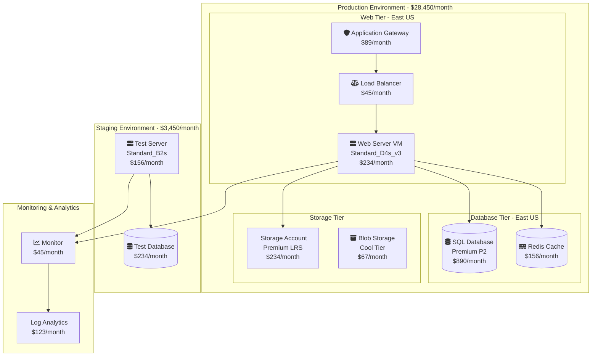

# ⚡ Quick Start Guide

Get CloudViz up and running in 5 minutes! This guide will walk you through the fastest way to visualize your cloud infrastructure.

## 🚀 **5-Minute Setup**

### **Option 1: Docker Compose (Recommended)**

The fastest way to get started:

```bash
# 1. Clone the repository
git clone https://github.com/navidrast/cloudviz.git
cd cloudviz

# 2. Start CloudViz
docker-compose up -d

# 3. Wait for services to start (about 30 seconds)
docker-compose logs -f cloudviz

# 4. Open CloudViz in your browser
open http://localhost:8000
```

### **Option 2: Python Installation**

If you prefer Python:

```bash
# 1. Clone and setup
git clone https://github.com/navidrast/cloudviz.git
cd cloudviz
python -m venv venv
source venv/bin/activate  # On Windows: venv\Scripts\activate

# 2. Install dependencies
pip install -r requirements/prod.txt
pip install -e .

# 3. Start CloudViz
uvicorn cloudviz.api.main:app --host 0.0.0.0 --port 8000

# 4. Open browser
open http://localhost:8000
```

## 🔑 **Initial Authentication**

1. **Open CloudViz**: Navigate to `http://localhost:8000`
2. **Default Login**: Use these credentials:
   - Username: `admin`
   - Password: `admin`
3. **Change Password**: Click your profile → Settings → Change Password

## ☁️ **Connect Your First Cloud Provider**

### **Azure Setup (2 minutes)**

1. **Create Service Principal**:
```bash
# Install Azure CLI if needed
curl -sL https://aka.ms/InstallAzureCLIDeb | sudo bash

# Login and create service principal
az login
az ad sp create-for-rbac --name "CloudViz" --role "Reader" --scopes "/subscriptions/YOUR_SUBSCRIPTION_ID"
```

2. **Configure CloudViz**:
```yaml
# config/local.yml
cloud_providers:
  azure:
    enabled: true
    subscription_id: "your-subscription-id"
    tenant_id: "your-tenant-id"
    client_id: "your-client-id"
    client_secret: "your-client-secret"
```

3. **Test Connection**:
```bash
curl -X GET http://localhost:8000/azure/test-connection \
  -H "Authorization: Bearer YOUR_JWT_TOKEN"
```

### **AWS Setup (2 minutes)**

1. **Create IAM User**:
```bash
# Create IAM user with ReadOnlyAccess policy
aws iam create-user --user-name cloudviz-readonly
aws iam attach-user-policy --user-name cloudviz-readonly --policy-arn arn:aws:iam::aws:policy/ReadOnlyAccess
aws iam create-access-key --user-name cloudviz-readonly
```

2. **Configure CloudViz**:
```yaml
# config/local.yml
cloud_providers:
  aws:
    enabled: true
    region: "us-west-2"
    access_key_id: "your-access-key"
    secret_access_key: "your-secret-key"
```

3. **Test Connection**:
```bash
curl -X GET http://localhost:8000/aws/test-connection \
  -H "Authorization: Bearer YOUR_JWT_TOKEN"
```

### **GCP Setup (3 minutes)**

1. **Create Service Account**:
```bash
# Install gcloud CLI
curl https://sdk.cloud.google.com | bash

# Create service account
gcloud iam service-accounts create cloudviz-readonly --display-name="CloudViz ReadOnly"

# Grant permissions
gcloud projects add-iam-policy-binding YOUR_PROJECT_ID \
  --member="serviceAccount:cloudviz-readonly@YOUR_PROJECT_ID.iam.gserviceaccount.com" \
  --role="roles/viewer"

# Download key file
gcloud iam service-accounts keys create cloudviz-key.json \
  --iam-account=cloudviz-readonly@YOUR_PROJECT_ID.iam.gserviceaccount.com
```

2. **Configure CloudViz**:
```yaml
# config/local.yml
cloud_providers:
  gcp:
    enabled: true
    project_id: "your-project-id"
    service_account_path: "/path/to/cloudviz-key.json"
```

## 🎨 **Create Your First Diagram**

### **Step 1: Discover Resources**

**Option A: Using the Web Interface**
1. Go to `http://localhost:8000/docs`
2. Click "Try it out" on `/azure/discover` endpoint
3. Enter your subscription details and click "Execute"

**Option B: Using cURL**
```bash
# Get JWT token
TOKEN=$(curl -X POST http://localhost:8000/auth/login \
  -H "Content-Type: application/json" \
  -d '{"username":"admin","password":"admin"}' | \
  jq -r '.access_token')

# Discover Azure resources
curl -X POST http://localhost:8000/azure/discover \
  -H "Authorization: Bearer $TOKEN" \
  -H "Content-Type: application/json" \
  -d '{
    "subscription_id": "your-subscription-id",
    "regions": ["eastus", "westus2"],
    "resource_groups": ["production", "staging"]
  }'
```

**Response:**
```json
{
  "discovery_id": "disc_azure_001",
  "status": "completed",
  "resources_found": 47,
  "cost_estimate": "$12,450/month",
  "regions": ["East US", "West US 2"]
}
```

### **Step 2: Generate Visualization**

```bash
# Generate hierarchical diagram
curl -X POST http://localhost:8000/visualization/generate \
  -H "Authorization: Bearer $TOKEN" \
  -H "Content-Type: application/json" \
  -d '{
    "discovery_ids": ["disc_azure_001"],
    "layout": "hierarchical",
    "theme": "enterprise",
    "include_costs": true,
    "include_dependencies": true
  }'
```

**Response:**
```json
{
  "diagram_id": "diag_001",
  "mermaid_code": "flowchart TD\n  subgraph Production\n    VM1[Web Server - $234/mo]\n    DB1[(SQL Database - $890/mo)]\n  end\n  subgraph Staging\n    VM2[Test Server - $156/mo]\n  end\n  VM1 --> DB1\n  VM2 --> DB1",
  "metadata": {
    "nodes": 15,
    "connections": 8,
    "cost_total": "$12,450/month"
  }
}
```

### **Step 3: View Your Diagram**

**Option A: Mermaid Online Editor**
1. Copy the `mermaid_code` from the response
2. Go to [mermaid.live](https://mermaid.live)
3. Paste the code and see your diagram!

**Option B: Export as Image**
```bash
# Export as PNG
curl -X POST http://localhost:8000/visualization/export \
  -H "Authorization: Bearer $TOKEN" \
  -H "Content-Type: application/json" \
  -d '{
    "diagram_id": "diag_001",
    "format": "png",
    "width": 1920,
    "height": 1080
  }' \
  --output infrastructure-diagram.png
```

## 🎯 **Example Results**

Here's what you'll see for a typical enterprise setup:



## 🔄 **Automation with n8n**

Set up automated daily discovery:

1. **Install n8n**:
```bash
npm install -g n8n
n8n start
```

2. **Import Workflow**:
```bash
# Import the daily discovery workflow
curl -X POST http://localhost:5678/api/v1/workflows/import \
  -H "Content-Type: application/json" \
  -d @examples/n8n-workflows/daily-infrastructure-discovery.json
```

3. **Configure Webhook**:
```bash
# Set up webhook endpoint
curl -X POST http://localhost:8000/webhooks/register \
  -H "Authorization: Bearer $TOKEN" \
  -H "Content-Type: application/json" \
  -d '{
    "url": "http://localhost:5678/webhook/cloudviz-discovery",
    "events": ["discovery.completed"],
    "secret": "your-webhook-secret"
  }'
```

## 📊 **Next Steps**

### **Immediate Actions**
1. **[Configure Security](Security)** - Set up proper authentication
2. **[Add More Providers](Multi-Cloud-Setup)** - Connect AWS and GCP
3. **[Customize Themes](Custom-Themes)** - Brand your diagrams
4. **[Set up Monitoring](Monitoring)** - Track system health

### **Advanced Features**
1. **[API Integration](API-Reference)** - Integrate with your systems
2. **[Enterprise Features](Enterprise-Features)** - RBAC, audit logging
3. **[Performance Tuning](Performance-Tuning)** - Optimize for scale
4. **[CI/CD Integration](CI-CD-Pipelines)** - Automate deployments

### **Community & Support**
1. **[Troubleshooting](Troubleshooting)** - Common issues and solutions
2. **[GitHub Issues](https://github.com/navidrast/cloudviz/issues)** - Report bugs
3. **[Discussions](https://github.com/navidrast/cloudviz/discussions)** - Ask questions
4. **[Contributing](Contributing)** - Help improve CloudViz

## 🎉 **Success Checklist**

- [ ] CloudViz is running at `http://localhost:8000`
- [ ] You can log in with admin credentials
- [ ] At least one cloud provider is configured
- [ ] You've discovered your first resources
- [ ] You've generated your first diagram
- [ ] You've exported a diagram image
- [ ] You've set up basic monitoring

## 🆘 **Need Help?**

### **Common Issues**

**Port 8000 already in use:**
```bash
# Find what's using the port
lsof -i :8000
# Or use a different port
uvicorn cloudviz.api.main:app --port 8001
```

**Docker services won't start:**
```bash
# Check logs
docker-compose logs cloudviz
# Restart services
docker-compose restart
```

**Cloud provider connection fails:**
```bash
# Test credentials manually
az account show  # Azure
aws sts get-caller-identity  # AWS
gcloud auth list  # GCP
```

### **Get Support**
- 📖 **Documentation**: This wiki has comprehensive guides
- 🐛 **Bug Reports**: [GitHub Issues](https://github.com/navidrast/cloudviz/issues)
- 💬 **Questions**: [GitHub Discussions](https://github.com/navidrast/cloudviz/discussions)
- 📧 **Enterprise Support**: Contact us for enterprise plans

---

**Congratulations! 🎉** You now have CloudViz running and visualizing your infrastructure. Time to explore the advanced features and automation capabilities! 🚀
