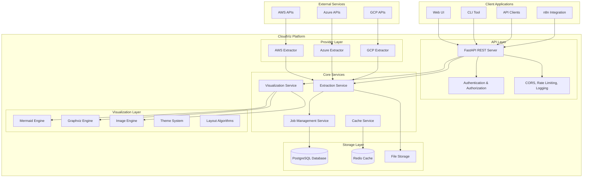

# CloudViz System Architecture

CloudViz is a comprehensive multi-cloud infrastructure visualization platform designed to discover, analyze, and visualize cloud resources across AWS, Azure, and Google Cloud Platform. The platform provides a REST API, multiple visualization formats, and extensive configuration options for enterprise deployment.

## Overview

CloudViz transforms complex cloud infrastructure into clear, actionable diagrams through automated resource discovery and intelligent visualization. The platform supports real-time extraction, relationship mapping, and multi-format output generation suitable for documentation, compliance, and operational analysis.

## Core Architecture

### High-Level Architecture

## Technology Stack

### Backend Framework
- **Python 3.8+** - Core runtime environment
- **FastAPI** - High-performance REST API framework with automatic OpenAPI documentation
- **Pydantic** - Data validation and serialization with type hints
- **Uvicorn/Gunicorn** - ASGI server for production deployment

### Cloud Provider SDKs
- **AWS**: boto3 (complete AWS service coverage)
- **Azure**: Azure SDK for Python with PowerShell Az modules integration
- **GCP**: Google Cloud Client Libraries

### Data Storage & Caching
- **PostgreSQL** - Primary database for metadata, job history, and configurations
- **Redis** - High-performance caching and session storage
- **SQLAlchemy** - Database ORM with migration support via Alembic

### Visualization Engines
- **Mermaid** - Modern diagram syntax with web-native rendering
- **Graphviz** - Traditional graph visualization with advanced layout algorithms
- **Cairo/Pillow** - Image processing for raster format generation

### Infrastructure & Deployment
- **Docker** - Containerized deployment with multi-stage builds
- **Docker Compose** - Local development and testing environment
- **Kubernetes** - Production-grade orchestration (configurations included)

## Component Details

### 1. API Layer

#### FastAPI REST Server
- **Endpoints**: 50+ REST endpoints covering all functionality
- **Authentication**: JWT-based with role-based access control (RBAC)
- **Rate Limiting**: Configurable per-endpoint rate limiting
- **CORS Support**: Cross-origin resource sharing for web clients
- **OpenAPI Documentation**: Automatic Swagger/ReDoc generation
- **Request Validation**: Comprehensive input validation using Pydantic models

#### Middleware Stack
- **Correlation ID**: Request tracking across service boundaries
- **Error Handling**: Centralized exception handling with detailed error responses
- **Logging**: Structured logging with correlation IDs and performance metrics
- **Security**: HTTPS enforcement, trusted host validation, security headers

### 2. Core Services

#### Extraction Service
**Capabilities:**
- **Multi-Cloud Support**: Simultaneous extraction from AWS, Azure, and GCP
- **Scope-Based Extraction**: Subscription, resource group, region, or tag-based filtering
- **Relationship Discovery**: Automatic detection of resource dependencies and connections
- **Incremental Updates**: Delta extraction for large environments
- **Background Processing**: Asynchronous job execution with progress tracking

**Resource Coverage:**
- **AWS**: 50+ resource types including EC2, S3, RDS, VPC, Lambda, ECS, etc.
- **Azure**: 60+ resource types including VMs, Storage, SQL, VNET, Functions, AKS, etc.
- **GCP**: 40+ resource types including Compute, Storage, SQL, VPC, Functions, GKE, etc.

#### Visualization Service
**Output Formats:**
- **Text-Based**: Mermaid, Graphviz DOT
- **Vector Graphics**: SVG, PDF
- **Raster Images**: PNG, JPG, JPEG (300+ DPI)

**Layout Algorithms:**
- **Hierarchical**: Top-down resource organization
- **Force-Directed**: Physics-based relationship visualization
- **Circular**: Radial arrangement for network topologies
- **Grid**: Structured grid layout for systematic views
- **Mindmap**: Central concept with branching resources
- **Timeline**: Chronological resource deployment view

**Themes:**
- **Professional**: Corporate-ready styling with neutral colors
- **Dark**: Dark mode optimized for development environments
- **Light**: High-contrast light theme for presentations
- **Minimal**: Clean, distraction-free visualization
- **Colorful**: Provider-specific color coding and rich styling

### 3. Provider Layer

#### AWS Extractor
**Authentication Methods:**
- Access Key ID / Secret Access Key
- IAM Roles with AssumeRole
- AWS SSO integration
- Instance metadata (for EC2-based deployments)

**Supported Services (50+):**
- **Compute**: EC2, ECS, EKS, Lambda, Batch
- **Storage**: S3, EBS, EFS, FSx
- **Database**: RDS, DynamoDB, ElastiCache, Redshift, Neptune
- **Networking**: VPC, Subnets, Security Groups, NACLs, Route Tables, NAT Gateways, Internet Gateways, VPN Gateways, Direct Connect
- **Load Balancing**: ALB, NLB, CLB, API Gateway
- **Security**: IAM, KMS, Secrets Manager, Certificate Manager
- **Monitoring**: CloudWatch, CloudTrail, X-Ray
- **Content Delivery**: CloudFront, Route 53
- **Analytics**: Kinesis, EMR, Glue, Athena
- **Machine Learning**: SageMaker, Comprehend, Rekognition

#### Azure Extractor
**Authentication Methods:**
- Service Principal (Client ID/Secret)
- Managed Identity (system and user-assigned)
- Interactive login with Azure CLI
- Device code flow for secure environments

**Supported Services (60+):**
- **Compute**: Virtual Machines, VMSS, Container Instances, AKS, Functions, App Service, Logic Apps
- **Storage**: Storage Accounts, Blob Storage, File Storage, Disk Storage
- **Database**: SQL Database, SQL Managed Instance, Cosmos DB, MySQL, PostgreSQL, Redis
- **Networking**: Virtual Networks, Subnets, NSGs, Public IPs, Load Balancers, Application Gateways, VPN Gateways, ExpressRoute
- **Security**: Key Vault, Security Center, Sentinel, Azure AD
- **Monitoring**: Monitor, Log Analytics, Application Insights
- **AI/ML**: Cognitive Services, Machine Learning, Bot Service
- **Integration**: Service Bus, Event Hubs, API Management
- **IoT**: IoT Hub, IoT Central, Digital Twins

#### GCP Extractor
**Authentication Methods:**
- Service Account JSON key files
- Application Default Credentials (ADC)
- OAuth 2.0 client credentials
- Workload Identity Federation

**Supported Services (40+):**
- **Compute**: Compute Engine, GKE, Cloud Functions, App Engine, Cloud Run
- **Storage**: Cloud Storage, Persistent Disks, Filestore
- **Database**: Cloud SQL, Firestore, Bigtable, Spanner, Memorystore
- **Networking**: VPC Networks, Subnets, Firewall Rules, Load Balancers, Cloud CDN, Cloud DNS
- **Security**: IAM, Security Command Center, KMS, Secret Manager
- **Monitoring**: Cloud Monitoring, Cloud Logging, Cloud Trace
- **Big Data**: BigQuery, Dataflow, Dataproc, Pub/Sub
- **AI/ML**: AI Platform, AutoML, Cloud Vision, Cloud Speech

### 4. Storage Layer

#### PostgreSQL Database
**Schema Design:**
- **Resource Metadata**: Complete resource inventories with versioning
- **Job Management**: Extraction and rendering job tracking with full audit trail
- **User Management**: Authentication, authorization, and RBAC
- **Configuration**: Provider settings, preferences, and templates
- **Relationships**: Resource dependency mapping and relationship graphs

**Performance Features:**
- Indexing on frequently queried fields
- Connection pooling with configurable limits
- Read replicas support for scaling
- Automated backup and point-in-time recovery

#### Redis Cache
**Caching Strategy:**
- **Resource Inventories**: TTL-based caching of extraction results
- **Rendered Diagrams**: Diagram caching for repeated requests
- **Session Storage**: User session and authentication token storage
- **Rate Limiting**: Distributed rate limiting counters
- **Job Status**: Real-time job progress and status updates

### 5. Security & Compliance

#### Authentication & Authorization
- **JWT Tokens**: Stateless authentication with configurable expiration
- **Role-Based Access Control**: Granular permissions for different user roles
- **API Key Authentication**: Service-to-service authentication
- **OAuth 2.0 Integration**: Third-party identity provider support

#### Security Features
- **TLS/HTTPS**: End-to-end encryption for all communications
- **Input Validation**: Comprehensive request validation and sanitization
- **SQL Injection Protection**: Parameterized queries and ORM usage
- **XSS Protection**: Content Security Policy and output encoding
- **Rate Limiting**: DDoS protection and resource abuse prevention

#### Compliance
- **GDPR Compliance**: Data processing and retention controls
- **SOC 2 Type II**: Security control framework adherence
- **Audit Logging**: Comprehensive audit trail for all operations
- **Data Encryption**: At-rest and in-transit encryption

## Deployment Architecture

### Development Environment
- Docker Compose with hot-reload
- Local PostgreSQL and Redis instances
- Development-optimized logging and debugging

### Production Environment
- **Container Orchestration**: Kubernetes with Helm charts
- **High Availability**: Multi-replica deployment with load balancing
- **Monitoring**: Prometheus metrics, Grafana dashboards, AlertManager
- **Logging**: Centralized logging with ELK/Loki stack
- **Backup**: Automated database backups and disaster recovery

### Scaling Characteristics
- **Horizontal Scaling**: Stateless API servers with load balancing
- **Background Job Processing**: Distributed task queue with Redis
- **Caching**: Multi-layer caching for performance optimization
- **Database Optimization**: Connection pooling and query optimization

## Integration Capabilities

### n8n Workflow Automation
- **Webhook Triggers**: Infrastructure change detection
- **Scheduled Extractions**: Automated periodic resource discovery
- **Alert Integration**: Automated diagram generation for incident response
- **Report Generation**: Scheduled infrastructure documentation

### API Integration
- **RESTful APIs**: Full CRUD operations for all resources
- **Webhook Support**: Real-time notifications for job completion
- **Bulk Operations**: Batch processing for large-scale operations
- **GraphQL**: Advanced query capabilities for complex data retrieval

### Export Integrations
- **Cloud Storage**: Direct upload to S3, Azure Blob, GCS
- **Documentation Platforms**: Integration with GitLab, GitHub, Confluence
- **Monitoring Tools**: Export to Grafana, Datadog, New Relic
- **ITSM Platforms**: ServiceNow, Jira Service Management integration

## Performance Characteristics

### Extraction Performance
- **Small Environments** (< 100 resources): 30-60 seconds
- **Medium Environments** (100-1000 resources): 2-5 minutes
- **Large Environments** (1000-10000 resources): 10-30 minutes
- **Enterprise Environments** (10000+ resources): 30+ minutes with parallel processing

### Visualization Performance
- **Mermaid Generation**: < 5 seconds for 1000+ resources
- **Image Rendering**: 10-30 seconds depending on complexity and format
- **Caching**: 95% cache hit rate for repeated requests

### Scalability Limits
- **Maximum Resources per Diagram**: 10,000 nodes (with performance optimization)
- **Concurrent Extractions**: 10 per instance (configurable)
- **API Throughput**: 1000+ requests/second with proper caching
- **Storage Requirements**: ~10MB per 1000 resources with full metadata
