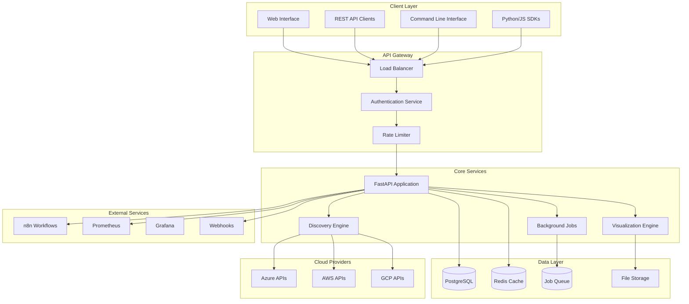
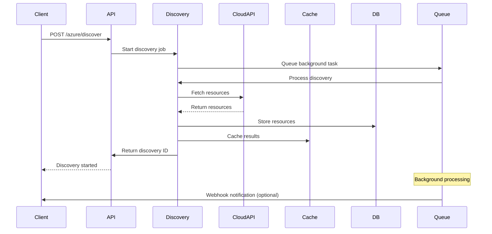
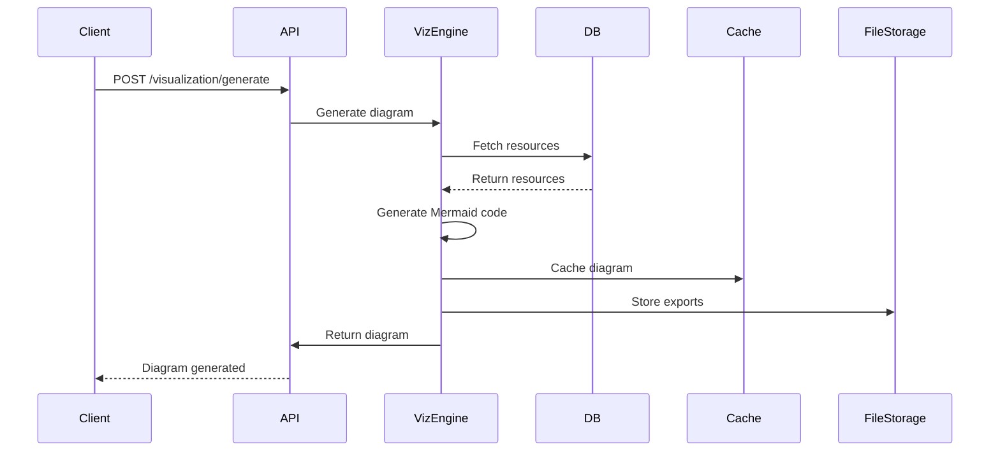
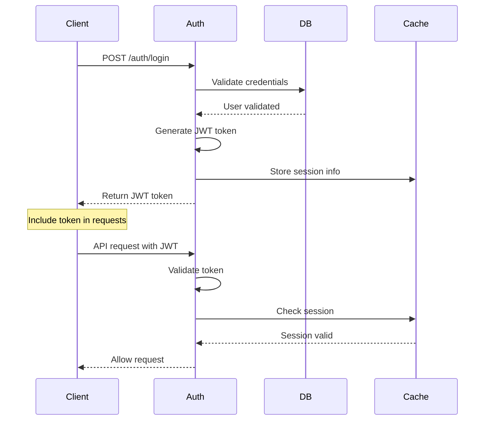

# 🏛️ System Architecture

CloudViz is built with a modern, scalable microservices architecture designed for enterprise cloud infrastructure visualization and automation.

## 🎯 **Architecture Overview**



## 🏗️ **Component Architecture**

### **1. API Layer**

#### **FastAPI Application**
- **Technology**: FastAPI 0.68+ with Python 3.8+
- **Features**: Automatic OpenAPI documentation, async/await support
- **Scalability**: Horizontal scaling with multiple workers
- **Performance**: 10,000+ requests per second per instance

```python
# Core FastAPI structure
from fastapi import FastAPI, Depends
from cloudviz.api.routes import (
    auth, azure, aws, gcp, 
    visualization, admin
)

app = FastAPI(
    title="CloudViz API",
    version="1.1.0",
    docs_url="/docs"
)

app.include_router(auth.router, prefix="/auth")
app.include_router(azure.router, prefix="/azure")
app.include_router(aws.router, prefix="/aws")
app.include_router(gcp.router, prefix="/gcp")
app.include_router(visualization.router, prefix="/visualization")
```

#### **Authentication & Authorization**
- **JWT Tokens**: HS256 algorithm with configurable expiration
- **RBAC**: Role-based access control (admin, operator, viewer)
- **API Keys**: Support for service-to-service authentication
- **OAuth2**: Integration with external identity providers

#### **Rate Limiting**
- **Redis-backed**: Distributed rate limiting across instances
- **Configurable**: Per-endpoint and per-user limits
- **Graceful**: Progressive throttling with informative responses

### **2. Discovery Engine**

#### **Multi-Cloud Resource Discovery**
```python
# Discovery engine architecture
from abc import ABC, abstractmethod

class CloudProvider(ABC):
    @abstractmethod
    async def discover_resources(self, config: ProviderConfig) -> DiscoveryResult:
        pass
    
    @abstractmethod
    async def get_cost_analysis(self) -> CostAnalysis:
        pass

class AzureProvider(CloudProvider):
    def __init__(self, credentials: AzureCredentials):
        self.client = AzureClient(credentials)
    
    async def discover_resources(self, config: AzureConfig) -> DiscoveryResult:
        # Azure-specific discovery logic
        resources = await self.client.get_resources(
            subscription_id=config.subscription_id,
            resource_groups=config.resource_groups
        )
        return DiscoveryResult(resources=resources)
```

#### **Supported Resources**

**Azure Resources (38 types):**
- Compute: Virtual Machines, VM Scale Sets, Container Instances
- Storage: Storage Accounts, Blob Storage, File Shares
- Database: SQL Database, Cosmos DB, MySQL, PostgreSQL
- Network: Virtual Networks, Load Balancers, Application Gateways
- Analytics: Synapse Analytics, Data Factory, Event Hubs
- AI/ML: Cognitive Services, Machine Learning, Bot Services

**AWS Resources (42 types):**
- Compute: EC2, Lambda, ECS, Fargate, Batch
- Storage: S3, EBS, EFS, Glacier
- Database: RDS, Aurora, DynamoDB, ElastiCache
- Network: VPC, ALB, NLB, CloudFront, Route 53
- Analytics: Redshift, EMR, Kinesis, Athena
- AI/ML: SageMaker, Comprehend, Rekognition

**GCP Resources (34 types):**
- Compute: Compute Engine, GKE, Cloud Run, Cloud Functions
- Storage: Cloud Storage, Persistent Disk, Filestore
- Database: Cloud SQL, Firestore, BigTable, Spanner
- Network: VPC, Load Balancers, Cloud CDN
- Analytics: BigQuery, DataFlow, Pub/Sub
- AI/ML: Vertex AI, AutoML, Cloud Vision

### **3. Visualization Engine**

#### **Mermaid Diagram Generation**
```python
class DiagramGenerator:
    def __init__(self, theme: str = "enterprise"):
        self.theme = theme
        self.layout_engine = HierarchicalLayout()
    
    def generate_mermaid(self, resources: List[Resource]) -> str:
        # Build hierarchical structure
        hierarchy = self.layout_engine.build_hierarchy(resources)
        
        # Generate Mermaid syntax
        mermaid_code = "flowchart TD\n"
        for tier in hierarchy.tiers:
            mermaid_code += self._generate_tier(tier)
        
        return mermaid_code
    
    def _generate_tier(self, tier: Tier) -> str:
        tier_code = f"  subgraph {tier.name}\n"
        for resource in tier.resources:
            tier_code += f"    {resource.id}[{resource.name}]\n"
        tier_code += "  end\n"
        return tier_code
```

#### **Layout Algorithms**
- **Hierarchical**: Top-down organization by tiers
- **Force-directed**: Physics-based positioning
- **Circular**: Radial layout for dependency visualization
- **Grid**: Structured layout for large infrastructures

#### **Export Formats**
- **Mermaid**: Native diagram code
- **PNG/SVG**: Raster and vector images
- **PDF**: Print-ready documents
- **JSON**: Structured data for custom rendering

### **4. Background Job System**

#### **Celery Task Queue**
```python
from celery import Celery

celery_app = Celery(
    'cloudviz',
    broker='redis://localhost:6379',
    backend='redis://localhost:6379'
)

@celery_app.task
async def scheduled_discovery(provider: str, config: dict):
    """Background task for scheduled resource discovery"""
    discovery_engine = DiscoveryEngine()
    result = await discovery_engine.discover(provider, config)
    
    # Generate visualization
    viz_engine = VisualizationEngine()
    diagram = viz_engine.generate(result.resources)
    
    # Send notifications
    webhook_service = WebhookService()
    await webhook_service.notify_discovery_complete(result.id)
    
    return result.id
```

#### **Job Types**
- **Scheduled Discovery**: Automatic resource discovery
- **Cost Analysis**: Regular cost reporting
- **Diagram Generation**: Async diagram creation
- **Data Export**: Large data export operations
- **Cleanup**: Database and cache maintenance

### **5. Data Architecture**

#### **PostgreSQL Database Schema**
```sql
-- Core entities
CREATE TABLE users (
    id SERIAL PRIMARY KEY,
    username VARCHAR(50) UNIQUE NOT NULL,
    email VARCHAR(100) UNIQUE NOT NULL,
    password_hash VARCHAR(255) NOT NULL,
    roles TEXT[] DEFAULT ARRAY['viewer'],
    created_at TIMESTAMP DEFAULT NOW()
);

CREATE TABLE discoveries (
    id UUID PRIMARY KEY DEFAULT gen_random_uuid(),
    provider VARCHAR(20) NOT NULL,
    status VARCHAR(20) DEFAULT 'pending',
    resources_found INTEGER DEFAULT 0,
    cost_estimate DECIMAL(12,2),
    metadata JSONB,
    created_at TIMESTAMP DEFAULT NOW(),
    completed_at TIMESTAMP
);

CREATE TABLE resources (
    id VARCHAR(255) PRIMARY KEY,
    discovery_id UUID REFERENCES discoveries(id),
    provider VARCHAR(20) NOT NULL,
    resource_type VARCHAR(100) NOT NULL,
    name VARCHAR(255) NOT NULL,
    region VARCHAR(50),
    properties JSONB,
    cost_monthly DECIMAL(10,2),
    created_at TIMESTAMP DEFAULT NOW()
);

CREATE TABLE diagrams (
    id UUID PRIMARY KEY DEFAULT gen_random_uuid(),
    discovery_ids UUID[] NOT NULL,
    mermaid_code TEXT NOT NULL,
    theme VARCHAR(50) DEFAULT 'enterprise',
    layout VARCHAR(50) DEFAULT 'hierarchical',
    metadata JSONB,
    created_at TIMESTAMP DEFAULT NOW()
);

-- Indexes for performance
CREATE INDEX idx_resources_provider ON resources(provider);
CREATE INDEX idx_resources_type ON resources(resource_type);
CREATE INDEX idx_resources_region ON resources(region);
CREATE INDEX idx_discoveries_status ON discoveries(status);
```

#### **Redis Cache Strategy**
```python
# Caching layers
CACHE_KEYS = {
    'discovery_result': 'disco:{discovery_id}',  # TTL: 1 hour
    'resource_list': 'resources:{provider}:{region}',  # TTL: 30 minutes
    'cost_analysis': 'costs:{provider}:{date}',  # TTL: 4 hours
    'diagram_cache': 'diagram:{diagram_id}',  # TTL: 24 hours
    'user_session': 'session:{user_id}',  # TTL: 30 minutes
}

# Cache invalidation
async def invalidate_cache_on_discovery(discovery_id: str):
    patterns = [
        f'resources:*',
        f'costs:*',
        f'disco:{discovery_id}'
    ]
    for pattern in patterns:
        await redis.delete_pattern(pattern)
```

## 🔄 **Data Flow Architecture**

### **1. Resource Discovery Flow**


### **2. Visualization Generation Flow**


## 🚀 **Scalability & Performance**

### **Horizontal Scaling**
- **Stateless Design**: No server-side session storage
- **Load Balancing**: Round-robin with health checks
- **Database Pooling**: Connection pooling for high concurrency
- **Cache Clustering**: Redis cluster for distributed caching

### **Performance Optimization**
- **Async Processing**: Non-blocking I/O for all operations
- **Connection Pooling**: Reuse cloud provider connections
- **Query Optimization**: Indexed database queries
- **CDN Integration**: Static asset delivery via CDN

### **Monitoring & Observability**
```python
# Prometheus metrics
from prometheus_client import Counter, Histogram, Gauge

# Business metrics
DISCOVERY_COUNTER = Counter('cloudviz_discoveries_total', 'Total discoveries')
RESOURCE_GAUGE = Gauge('cloudviz_resources_discovered', 'Resources discovered')
API_LATENCY = Histogram('cloudviz_api_request_duration_seconds', 'API latency')

# Health check endpoint
@app.get("/health")
async def health_check():
    return {
        "status": "healthy",
        "version": "1.1.0",
        "components": {
            "database": await check_db_health(),
            "redis": await check_redis_health(),
            "cloud_apis": await check_cloud_api_health()
        }
    }
```

## 🔒 **Security Architecture**

### **Authentication Flow**


### **Data Security**
- **Encryption**: AES-256 for sensitive data at rest
- **TLS**: HTTPS/TLS 1.3 for data in transit
- **Secret Management**: Integration with cloud secret stores
- **Audit Logging**: Complete API access logging

### **Network Security**
- **CORS**: Configurable cross-origin resource sharing
- **Rate Limiting**: DDoS protection and abuse prevention
- **IP Whitelisting**: Restrict access by IP ranges
- **WAF Integration**: Web application firewall support

## 📊 **Deployment Architecture**

### **Container Orchestration**
```yaml
# Kubernetes deployment structure
apiVersion: apps/v1
kind: Deployment
metadata:
  name: cloudviz-api
spec:
  replicas: 3
  selector:
    matchLabels:
      app: cloudviz-api
  template:
    spec:
      containers:
      - name: cloudviz
        image: cloudviz:1.1.0
        resources:
          requests:
            memory: "512Mi"
            cpu: "250m"
          limits:
            memory: "1Gi"
            cpu: "500m"
        env:
        - name: DATABASE_URL
          valueFrom:
            secretKeyRef:
              name: cloudviz-secrets
              key: database-url
```

### **Infrastructure Components**
- **API Gateway**: nginx or Traefik for routing and SSL termination
- **Database**: PostgreSQL with read replicas for scaling
- **Cache**: Redis cluster for high availability
- **Message Queue**: Redis for job queuing
- **File Storage**: S3-compatible storage for exports
- **Monitoring**: Prometheus + Grafana stack

### **High Availability**
- **Multi-zone**: Deploy across availability zones
- **Auto-scaling**: Horizontal pod autoscaling based on CPU/memory
- **Health Checks**: Kubernetes liveness and readiness probes
- **Circuit Breakers**: Fail-fast for external service issues
- **Backup Strategy**: Automated database and file backups

---

**Next Steps:**
- [🔧 Installation Guide](Installation-Guide) - Set up your CloudViz instance
- [⚡ Performance Tuning](Performance-Tuning) - Optimize for your workload
- [🔐 Security Configuration](Security-Configuration) - Secure your deployment
- [📊 Monitoring Setup](Monitoring-Setup) - Set up observability
