# Visualization

CloudViz provides powerful visualization capabilities for infrastructure diagrams using Mermaid syntax with customizable themes, layouts, and export options. This guide covers all aspects of CloudViz visualization features.

## 🎨 Overview

CloudViz transforms cloud resource data into beautiful, interactive diagrams that help you:

- **Understand Infrastructure**: Visual representation of your cloud resources
- **Identify Dependencies**: See how resources connect and depend on each other
- **Analyze Costs**: Visualize cost distribution across your infrastructure
- **Security Analysis**: Highlight security configurations and potential issues
- **Documentation**: Generate architecture documentation automatically

## 📊 Diagram Types

### 1. **Hierarchical Diagrams**
Organize resources in a top-down hierarchy showing logical groupings.

```mermaid
flowchart TD
    CLOUD[☁️ Azure Cloud] --> SUBSCRIPTION[📋 Production Subscription]
    SUBSCRIPTION --> RG_PROD[📁 Production Resource Group]
    SUBSCRIPTION --> RG_STAGING[📁 Staging Resource Group]
    
    RG_PROD --> NETWORK_TIER[🌐 Network Tier]
    RG_PROD --> APP_TIER[💼 Application Tier]
    RG_PROD --> DATA_TIER[🗄️ Data Tier]
    
    NETWORK_TIER --> VNET[🔗 Production VNet]
    NETWORK_TIER --> NSG[🛡️ Network Security Group]
    
    APP_TIER --> VMSS[🔄 VM Scale Set]
    APP_TIER --> LB[⚖️ Load Balancer]
    
    DATA_TIER --> SQL[🗃️ SQL Database]
    DATA_TIER --> STORAGE[💾 Storage Account]
```



### 2. **Network Topology Diagrams**
Focus on network connections and data flow.

```mermaid
graph LR
    INTERNET[🌍 Internet] --> AGW[🌐 Application Gateway]
    AGW --> VNET[🔗 VNet: 10.0.0.0/16]
    
    VNET --> WEB_SUBNET[Web Subnet: 10.0.1.0/24]
    VNET --> APP_SUBNET[App Subnet: 10.0.2.0/24]
    VNET --> DB_SUBNET[DB Subnet: 10.0.3.0/24]
    
    WEB_SUBNET --> WEB_VM[🖥️ Web VM]
    APP_SUBNET --> APP_VM[⚙️ App VM]
    DB_SUBNET --> SQL_VM[🗃️ SQL VM]
```



### 3. **Cost-Focused Diagrams**
Highlight resource costs and spending patterns.

```mermaid
flowchart TD
    TOTAL[💰 Total: $15,640/month] --> COMPUTE[💻 Compute: $8,900]
    TOTAL --> STORAGE[💾 Storage: $3,200]
    TOTAL --> NETWORK[🌐 Network: $2,100]
    TOTAL --> SECURITY[🔒 Security: $1,440]
    
    COMPUTE --> VM1[🖥️ Web VMs: $3,400]
    COMPUTE --> VM2[⚙️ App VMs: $2,800]
    COMPUTE --> VMSS[🔄 VMSS: $2,700]
    
    STORAGE --> SQL[🗃️ SQL Storage: $2,100]
    STORAGE --> BLOB[📦 Blob Storage: $800]
    STORAGE --> DISK[💿 Managed Disks: $300]
```



### 4. **Security-Focused Diagrams**
Emphasize security configurations and potential vulnerabilities.

```mermaid
flowchart TD
    INTERNET[🌍 Internet] -->|HTTPS:443| WAF[🛡️ Web App Firewall]
    WAF -->|Filtered Traffic| LB[⚖️ Load Balancer]
    
    LB --> WEB_VM1[🖥️ Web VM 1]
    LB --> WEB_VM2[🖥️ Web VM 2]
    
    WEB_VM1 -->|Internal Only| APP_VM[⚙️ App Server]
    WEB_VM2 -->|Internal Only| APP_VM
    
    APP_VM -->|Encrypted| SQL[🔒 SQL Database]
    
    classDef secure fill:#27ae60,stroke:#1e8449,color:#fff
    classDef warning fill:#f39c12,stroke:#d68910,color:#fff
    classDef critical fill:#e74c3c,stroke:#c0392b,color:#fff
    
    class WAF,SQL secure
    class LB warning
```



## 🎭 Themes

CloudViz provides multiple visualization themes to suit different use cases and audiences.

### Enterprise Theme (Default)
Professional corporate styling suitable for business presentations.

**Colors:**
- **Compute**: Purple (`#9b59b6`)
- **Network**: Blue (`#3498db`)
- **Storage**: Orange (`#e67e22`)
- **Security**: Red (`#e74c3c`)
- **Management**: Green (`#27ae60`)

### Security Theme
Emphasizes security aspects with traffic light colors.

**Colors:**
- **Secure**: Green (`#27ae60`)
- **Warning**: Yellow (`#f39c12`)
- **Critical**: Red (`#e74c3c`)
- **Unknown**: Gray (`#95a5a6`)

### Cost Theme
Highlights cost information with heat map colors.

**Colors:**
- **Low Cost**: Green (`#27ae60`)
- **Medium Cost**: Yellow (`#f1c40f`)
- **High Cost**: Orange (`#e67e22`)
- **Very High Cost**: Red (`#e74c3c`)

### Minimal Theme
Clean, minimal styling for documentation.

**Colors:**
- **Primary**: Dark Gray (`#2c3e50`)
- **Secondary**: Light Gray (`#7f8c8d`)
- **Accent**: Blue (`#3498db`)

### Dark Theme
Dark background theme for presentations and modern interfaces.

**Colors:**
- **Background**: Dark (`#2c3e50`)
- **Text**: Light (`#ecf0f1`)
- **Nodes**: Various bright colors
- **Edges**: Light gray (`#95a5a6`)

## 🔧 Configuration

### Theme Configuration

```yaml
# Theme configuration in config/visualization.yml
visualization:
  themes:
    enterprise:
      name: "Enterprise"
      description: "Professional corporate theme"
      colors:
        compute: "#9b59b6"
        network: "#3498db"
        storage: "#e67e22"
        security: "#e74c3c"
        management: "#27ae60"
        database: "#8e44ad"
      styles:
        node_shape: "rounded"
        edge_style: "solid"
        font_family: "Arial, sans-serif"
        font_size: "12px"
        
    security:
      name: "Security Focus"
      description: "Security-oriented visualization"
      colors:
        secure: "#27ae60"
        warning: "#f39c12"
        critical: "#e74c3c"
        unknown: "#95a5a6"
      icons:
        firewall: "🛡️"
        encryption: "🔒"
        access_control: "🔐"
        monitoring: "👁️"
```

### Layout Options

```yaml
visualization:
  layouts:
    hierarchical:
      direction: "TD"  # Top-Down
      spacing:
        node: 50
        rank: 100
      grouping:
        by_resource_group: true
        by_region: true
        by_tier: true
        
    network:
      direction: "LR"  # Left-Right
      show_subnets: true
      show_connections: true
      emphasize_security: true
      
    flat:
      direction: "TD"
      group_similar: true
      show_all_dependencies: false
      
    cost:
      sort_by_cost: true
      show_cost_percentages: true
      group_by_cost_tier: true
```

## 🎯 Advanced Features

### Resource Grouping

CloudViz automatically groups resources for better visualization:

```json
{
  "grouping": {
    "strategy": "hierarchical",
    "levels": [
      {
        "name": "provider",
        "field": "provider",
        "icon": "☁️"
      },
      {
        "name": "subscription",
        "field": "subscription_id",
        "icon": "📋"
      },
      {
        "name": "resource_group",
        "field": "resource_group",
        "icon": "📁"
      },
      {
        "name": "tier",
        "field": "tags.tier",
        "icon": "🏗️"
      }
    ]
  }
}
```

### Dependency Visualization

Show relationships between resources:

```mermaid
flowchart TD
    VM[🖥️ Web VM] --> NIC[🔌 Network Interface]
    VM --> DISK[💿 OS Disk]
    VM --> NSG[🛡️ Network Security Group]
    
    NIC --> SUBNET[🌐 Web Subnet]
    NIC --> PIP[🌍 Public IP]
    
    SUBNET --> VNET[🔗 Virtual Network]
    VNET --> RG[📁 Resource Group]
    
    style VM fill:#9b59b6,stroke:#8e44ad,color:#fff
    style NIC fill:#3498db,stroke:#2980b9,color:#fff
    style DISK fill:#e67e22,stroke:#d35400,color:#fff
    style NSG fill:#e74c3c,stroke:#c0392b,color:#fff
```



### Cost Integration

Include cost information in diagrams:

```json
{
  "cost_visualization": {
    "enabled": true,
    "display_mode": "node_label",
    "format": "monthly",
    "currency": "USD",
    "thresholds": {
      "low": 100,
      "medium": 500,
      "high": 1000
    },
    "color_coding": {
      "low": "#27ae60",
      "medium": "#f1c40f",
      "high": "#e67e22",
      "very_high": "#e74c3c"
    }
  }
}
```

### Interactive Features

Enable interactive elements in generated diagrams:

```json
{
  "interactive": {
    "enabled": true,
    "features": {
      "click_to_expand": true,
      "hover_tooltips": true,
      "zoom_and_pan": true,
      "search_highlight": true
    },
    "tooltips": {
      "show_properties": true,
      "show_costs": true,
      "show_dependencies": true,
      "show_security_status": true
    }
  }
}
```

## 📤 Export Options

### Mermaid Markdown

Basic Mermaid syntax for embedding in documentation:

```bash
# Generate Mermaid diagram
curl -X POST "http://localhost:8000/api/v1/diagrams/mermaid" \
     -H "Content-Type: application/json" \
     -d '{
       "resources": [...],
       "theme": "enterprise",
       "layout": "hierarchical"
     }'
```

Response:
```markdown

```mermaid
flowchart TD
    AZURE[☁️ Azure Cloud] --> RG[📁 Production]
    RG --> VM[🖥️ Web Server]
    RG --> SQL[🗃️ Database]
```

```

### PNG Export

High-quality images for presentations and documentation:

```bash
# Generate PNG image
curl -X POST "http://localhost:8000/api/v1/diagrams/mermaid/png" \
     -H "Content-Type: application/json" \
     -d '{
       "resources": [...],
       "theme": "enterprise",
       "width": 1920,
       "height": 1080,
       "background": "white"
     }' \
     --output infrastructure.png
```

### SVG Export

Vector graphics for scalable diagrams:

```bash
# Generate SVG
curl -X POST "http://localhost:8000/api/v1/diagrams/mermaid/svg" \
     -H "Content-Type: application/json" \
     -d '{
       "resources": [...],
       "theme": "enterprise"
     }' \
     --output infrastructure.svg
```

### PDF Export

Multi-page PDF documentation:

```bash
# Generate PDF with multiple views
curl -X POST "http://localhost:8000/api/v1/diagrams/pdf" \
     -H "Content-Type: application/json" \
     -d '{
       "resources": [...],
       "pages": [
         {"type": "overview", "theme": "enterprise"},
         {"type": "network", "theme": "security"},
         {"type": "costs", "theme": "cost"}
       ]
     }' \
     --output infrastructure.pdf
```

## 🎨 Custom Themes

Create custom themes for your organization:

```yaml
# config/themes/corporate.yml
name: "Corporate Brand"
description: "Matches our corporate brand colors"

colors:
  primary: "#FF6B35"      # Corporate orange
  secondary: "#004E89"    # Corporate blue
  accent: "#009639"       # Corporate green
  neutral: "#6A6A6A"      # Corporate gray
  
  # Resource type mappings
  compute: "#004E89"
  network: "#009639"
  storage: "#FF6B35"
  security: "#8B0000"
  management: "#6A6A6A"

styles:
  node_shape: "round"
  edge_style: "curved"
  font_family: "Roboto, sans-serif"
  font_size: "11px"
  border_width: "2px"

icons:
  # Custom icon mappings
  virtual_machine: "🖥️"
  database: "🗄️"
  storage: "💾"
  network: "🌐"
  security: "🔒"

layout_defaults:
  spacing: 60
  padding: 20
  margin: 30
```

## 🔄 Dynamic Diagrams

Generate diagrams that update based on current infrastructure state:

### Real-time Updates

```javascript
// JavaScript for dynamic diagram updates
const updateDiagram = async () => {
  const resources = await fetch('/api/v1/azure/resources').then(r => r.json());
  const diagram = await fetch('/api/v1/diagrams/mermaid', {
    method: 'POST',
    headers: {'Content-Type': 'application/json'},
    body: JSON.stringify({
      resources: resources.resources,
      theme: 'enterprise',
      timestamp: new Date().toISOString()
    })
  }).then(r => r.json());
  
  // Update diagram in browser
  mermaid.render('diagram', diagram.diagram);
};

// Update every 5 minutes
setInterval(updateDiagram, 300000);
```

### Conditional Styling

Apply different styles based on resource state:

```json
{
  "conditional_styling": {
    "rules": [
      {
        "condition": "resource.power_state == 'running'",
        "style": {
          "fill": "#27ae60",
          "stroke": "#1e8449"
        }
      },
      {
        "condition": "resource.power_state == 'stopped'",
        "style": {
          "fill": "#e74c3c",
          "stroke": "#c0392b"
        }
      },
      {
        "condition": "resource.cost.monthly > 1000",
        "style": {
          "border": "3px solid #e74c3c",
          "font_weight": "bold"
        }
      }
    ]
  }
}
```

## 📊 Diagram Templates

Pre-built templates for common scenarios:

### Infrastructure Overview Template

```json
{
  "template": "infrastructure_overview",
  "description": "High-level infrastructure overview",
  "config": {
    "theme": "enterprise",
    "layout": "hierarchical",
    "grouping": ["provider", "region", "resource_group"],
    "show_costs": true,
    "show_dependencies": false,
    "max_depth": 3
  }
}
```

### Security Assessment Template

```json
{
  "template": "security_assessment",
  "description": "Security-focused infrastructure view",
  "config": {
    "theme": "security",
    "layout": "network",
    "highlight_security_issues": true,
    "show_public_endpoints": true,
    "show_encryption_status": true,
    "show_access_controls": true
  }
}
```

### Cost Analysis Template

```json
{
  "template": "cost_analysis",
  "description": "Cost-focused infrastructure analysis",
  "config": {
    "theme": "cost",
    "layout": "hierarchical",
    "sort_by_cost": true,
    "show_cost_percentages": true,
    "group_by_cost_tier": true,
    "highlight_expensive_resources": true
  }
}
```

## 🛠️ API Integration

### Generate Diagram from API

```python
import requests

# Discovery and visualization in one call
response = requests.post(
    "http://localhost:8000/api/v1/workflows/discover-and-visualize",
    headers={"Authorization": f"Bearer {token}"},
    json={
        "provider": "azure",
        "filters": {
            "resource_group": "production",
            "regions": ["australiaeast"]
        },
        "visualization": {
            "theme": "enterprise",
            "layout": "hierarchical",
            "export_format": "png"
        }
    }
)

# Save diagram
with open("infrastructure.png", "wb") as f:
    f.write(response.content)
```

### Batch Generation

Generate multiple diagram variants:

```python
variants = [
    {"theme": "enterprise", "layout": "hierarchical"},
    {"theme": "security", "layout": "network"},
    {"theme": "cost", "layout": "hierarchical"}
]

for i, variant in enumerate(variants):
    response = requests.post(
        f"http://localhost:8000/api/v1/diagrams/mermaid/png",
        json={
            "resources": resources,
            **variant
        }
    )
    
    with open(f"diagram_variant_{i+1}.png", "wb") as f:
        f.write(response.content)
```

## 📱 Integration Examples

### Embed in Jupyter Notebooks

```python
from IPython.display import Image, display
import requests

# Generate and display diagram in notebook
response = requests.post(
    "http://localhost:8000/api/v1/diagrams/mermaid/png",
    json={"resources": resources, "theme": "enterprise"}
)

display(Image(response.content))
```

### Slack Bot Integration

```python
# Post diagram to Slack
def post_infrastructure_diagram(channel):
    # Generate diagram
    response = requests.post(
        "http://localhost:8000/api/v1/diagrams/mermaid/png",
        json={"resources": resources, "theme": "enterprise"}
    )
    
    # Upload to Slack
    slack_client.files_upload(
        channels=channel,
        file=response.content,
        filename="infrastructure.png",
        title="Current Infrastructure Overview"
    )
```

### Teams Integration

```javascript
// Microsoft Teams bot
const generateInfrastructureDiagram = async (context) => {
    const response = await fetch('http://localhost:8000/api/v1/diagrams/mermaid/png', {
        method: 'POST',
        headers: {'Content-Type': 'application/json'},
        body: JSON.stringify({
            resources: resources,
            theme: 'enterprise'
        })
    });
    
    const attachment = {
        contentType: 'image/png',
        content: await response.buffer(),
        name: 'infrastructure.png'
    };
    
    await context.sendActivity({
        attachments: [attachment]
    });
};
```

---

For more visualization examples and integration patterns, see our **[Examples](Examples)** page or explore the **[n8n Integration Guide](n8n-Integration)** for automated diagram generation workflows.