# n8n Integration

CloudViz provides deep integration with n8n, the popular workflow automation platform. This guide covers setup, pre-built workflows, custom integrations, and advanced automation patterns.

## 🔄 Overview

n8n integration enables you to:

- **Automated Discovery**: Schedule regular infrastructure scans
- **Incident Response**: Generate diagrams when alerts are triggered
- **Compliance Reporting**: Create periodic infrastructure documentation
- **Change Detection**: Monitor and visualize infrastructure changes
- **Multi-platform Notifications**: Send diagrams via Slack, Teams, email
- **CI/CD Integration**: Include infrastructure diagrams in pipelines

## 🚀 Quick Start

### Prerequisites

1. **Running n8n Instance**: Cloud or self-hosted n8n
2. **CloudViz API**: Accessible CloudViz instance
3. **Authentication**: API tokens for both systems
4. **Webhook Access**: For real-time integrations

### Basic Setup

1. **Configure CloudViz Connection in n8n**
   
   Add CloudViz as an HTTP request credential:
   ```json
   {
     "name": "CloudViz API",
     "type": "httpBasicAuth",
     "baseURL": "http://your-cloudviz-instance:8000",
     "authentication": "headerAuth",
     "headerAuth": {
       "name": "Authorization",
       "value": "Bearer your-jwt-token"
     }
   }
   ```

2. **Test Connection**
   
   Create a simple workflow to test connectivity:
   ```json
   {
     "nodes": [
       {
         "name": "Test CloudViz",
         "type": "n8n-nodes-base.httpRequest",
         "parameters": {
           "url": "/health",
           "method": "GET"
         },
         "credentials": {
           "httpBasicAuth": "CloudViz API"
         }
       }
     ]
   }
   ```

## 📦 Pre-built Workflows

CloudViz includes several ready-to-use n8n workflows in the `examples/n8n-workflows/` directory.

### 1. Daily Infrastructure Discovery

**File**: `daily-infrastructure-discovery.json`

Automatically discovers and visualizes your infrastructure on a daily schedule.

**Features**:
- Scheduled daily execution (configurable)
- Azure resource discovery
- Mermaid diagram generation
- PNG export for sharing
- Multi-channel notifications

**Configuration**:
```json
{
  "schedule": "0 8 * * *",
  "azure_config": {
    "resource_groups": ["production", "staging"],
    "regions": ["australiaeast", "australiasoutheast"]
  },
  "visualization": {
    "theme": "enterprise",
    "include_costs": true
  },
  "notifications": {
    "slack": {
      "channel": "#infrastructure",
      "webhook_url": "your-slack-webhook"
    },
    "email": {
      "recipients": ["team@company.com"],
      "smtp_config": {...}
    }
  }
}
```

**Workflow Steps**:
1. **Trigger**: Daily schedule (8 AM)
2. **Authenticate**: Get CloudViz JWT token
3. **Discover**: Fetch Azure resources
4. **Generate**: Create Mermaid diagram
5. **Export**: Generate PNG image
6. **Notify**: Send to Slack/email
7. **Store**: Save artifacts

### 2. Incident Response Diagram

**File**: `incident-response-diagram.json`

Generates infrastructure diagrams when incidents are detected for rapid impact analysis.

**Features**:
- Webhook-triggered execution
- Severity-based filtering
- Affected resource analysis
- Alert-themed visualizations
- Multi-channel notifications

**Trigger Configuration**:
```json
{
  "webhook": {
    "path": "/cloudviz-incident",
    "authentication": "headerAuth",
    "expectedHeaders": {
      "x-api-key": "your-secret-key"
    }
  },
  "payload_example": {
    "incident_id": "INC-12345",
    "severity": "high",
    "affected_resources": [
      "production-vm-01",
      "production-sql-01"
    ],
    "region": "australiaeast",
    "description": "Database connectivity issues"
  }
}
```

**Workflow Logic**:
```javascript
// Extract incident details
const incident = $input.first().json;

// Determine scope based on severity
const scope = {
  high: ["production"],
  medium: ["production", "staging"], 
  low: ["all"]
}[incident.severity];

// Generate impact analysis diagram
const resources = await $this.helpers.httpRequest({
  method: 'GET',
  url: `/api/v1/azure/resources`,
  qs: {
    resource_groups: scope.join(','),
    regions: incident.region,
    include_dependencies: true
  }
});

// Highlight affected resources
const diagramConfig = {
  resources: resources.resources,
  theme: 'security',
  highlight_resources: incident.affected_resources,
  title: `Incident ${incident.incident_id} - Impact Analysis`
};
```

### 3. Cost Monitoring Workflow

**File**: `cost-monitoring-workflow.json`

Monitors infrastructure costs and generates cost-focused diagrams when thresholds are exceeded.

**Features**:
- Cost threshold monitoring
- Trend analysis
- Cost-optimized visualizations
- Budget alerts
- Executive reporting

### 4. Security Compliance Check

**File**: `security-compliance-workflow.json`

Regular security posture assessment with visualization.

**Features**:
- Security configuration scanning
- Compliance rule checking
- Security-themed diagrams
- Risk assessment reports
- Automated remediation suggestions

### 5. Change Detection Workflow

**File**: `change-detection-workflow.json`

Detects and visualizes infrastructure changes.

**Features**:
- Before/after comparisons
- Change impact analysis
- Approval workflows
- Change documentation
- Rollback planning

## 🔧 Custom Workflow Development

### Basic Workflow Structure

```json
{
  "name": "CloudViz Custom Workflow",
  "nodes": [
    {
      "name": "Trigger",
      "type": "n8n-nodes-base.scheduleTrigger",
      "parameters": {
        "rule": {
          "interval": [{"field": "cronExpression", "value": "0 */6 * * *"}]
        }
      }
    },
    {
      "name": "Authenticate CloudViz",
      "type": "n8n-nodes-base.httpRequest",
      "parameters": {
        "url": "http://localhost:8000/api/v1/auth/login",
        "method": "POST",
        "body": {
          "username": "={{$env.CLOUDVIZ_USERNAME}}",
          "password": "={{$env.CLOUDVIZ_PASSWORD}}"
        }
      }
    },
    {
      "name": "Discover Resources",
      "type": "n8n-nodes-base.httpRequest",
      "parameters": {
        "url": "http://localhost:8000/api/v1/azure/resources",
        "method": "GET",
        "headers": {
          "Authorization": "Bearer ={{$node['Authenticate CloudViz'].json.access_token}}"
        },
        "qs": {
          "resource_group": "production",
          "include_costs": "true"
        }
      }
    },
    {
      "name": "Generate Diagram",
      "type": "n8n-nodes-base.httpRequest",
      "parameters": {
        "url": "http://localhost:8000/api/v1/diagrams/mermaid",
        "method": "POST",
        "headers": {
          "Authorization": "Bearer ={{$node['Authenticate CloudViz'].json.access_token}}",
          "Content-Type": "application/json"
        },
        "body": {
          "resources": "={{$node['Discover Resources'].json.resources}}",
          "theme": "enterprise",
          "layout": "hierarchical",
          "include_costs": true
        }
      }
    }
  ],
  "connections": {
    "Trigger": {"main": [["Authenticate CloudViz"]]},
    "Authenticate CloudViz": {"main": [["Discover Resources"]]},
    "Discover Resources": {"main": [["Generate Diagram"]]}
  }
}
```

### Advanced Workflow Patterns

#### 1. Multi-Provider Discovery

```javascript
// JavaScript code node for multi-provider discovery
const providers = ['azure', 'aws', 'gcp'];
const allResources = [];

for (const provider of providers) {
  try {
    const response = await $this.helpers.httpRequest({
      method: 'GET',
      url: `/api/v1/${provider}/resources`,
      headers: {
        'Authorization': `Bearer ${$node['Authenticate'].json.access_token}`
      }
    });
    
    allResources.push(...response.resources.map(r => ({
      ...r,
      provider: provider
    })));
  } catch (error) {
    console.log(`Failed to discover ${provider} resources:`, error);
  }
}

return [{
  json: {
    resources: allResources,
    total_count: allResources.length,
    providers: providers,
    timestamp: new Date().toISOString()
  }
}];
```

#### 2. Conditional Diagram Generation

```javascript
// Generate different diagrams based on conditions
const resources = $input.first().json.resources;
const totalCost = resources.reduce((sum, r) => sum + (r.cost || 0), 0);

let diagramConfig = {
  resources: resources,
  layout: 'hierarchical'
};

// Choose theme based on cost
if (totalCost > 10000) {
  diagramConfig.theme = 'cost';
  diagramConfig.highlight_expensive = true;
} else if (resources.some(r => r.security_issues?.length > 0)) {
  diagramConfig.theme = 'security';
  diagramConfig.highlight_security_issues = true;
} else {
  diagramConfig.theme = 'enterprise';
}

return [{ json: diagramConfig }];
```

#### 3. Dynamic Filtering

```javascript
// Dynamic resource filtering based on tags
const filterCriteria = $input.first().json;
const allResources = $node['Discover Resources'].json.resources;

const filteredResources = allResources.filter(resource => {
  // Environment filter
  if (filterCriteria.environment) {
    if (resource.tags?.environment !== filterCriteria.environment) {
      return false;
    }
  }
  
  // Cost filter
  if (filterCriteria.max_cost) {
    if ((resource.cost || 0) > filterCriteria.max_cost) {
      return false;
    }
  }
  
  // Region filter
  if (filterCriteria.regions?.length > 0) {
    if (!filterCriteria.regions.includes(resource.region)) {
      return false;
    }
  }
  
  return true;
});

return [{
  json: {
    resources: filteredResources,
    filter_criteria: filterCriteria,
    original_count: allResources.length,
    filtered_count: filteredResources.length
  }
}];
```

## 📊 Workflow Templates

### Executive Dashboard Workflow

```json
{
  "name": "Executive Infrastructure Dashboard",
  "description": "Weekly executive summary with multiple diagram views",
  "schedule": "0 9 * * 1",
  "steps": [
    {
      "name": "Generate Overview",
      "config": {
        "theme": "enterprise",
        "level": "high",
        "include_costs": true,
        "max_depth": 2
      }
    },
    {
      "name": "Generate Cost Analysis", 
      "config": {
        "theme": "cost",
        "sort_by_cost": true,
        "show_trends": true
      }
    },
    {
      "name": "Generate Security Status",
      "config": {
        "theme": "security",
        "highlight_issues": true,
        "compliance_check": true
      }
    },
    {
      "name": "Create Report",
      "format": "pdf",
      "include_all_diagrams": true,
      "email_to": ["executives@company.com"]
    }
  ]
}
```

### DevOps Integration Workflow

```json
{
  "name": "DevOps Pipeline Integration",
  "description": "Integration with CI/CD pipelines",
  "triggers": [
    {
      "type": "webhook",
      "path": "/pipeline-complete",
      "source": "github_actions"
    }
  ],
  "steps": [
    {
      "name": "Validate Deployment",
      "discover_new_resources": true,
      "compare_with_previous": true
    },
    {
      "name": "Generate Infrastructure Docs",
      "output_formats": ["markdown", "png"],
      "update_repository": true
    },
    {
      "name": "Security Scan",
      "run_security_analysis": true,
      "fail_on_critical": true
    }
  ]
}
```

## 🔔 Notification Integrations

### Slack Integration

```javascript
// Slack notification with diagram
const diagramUrl = $node['Generate Diagram'].json.png_url;

await $this.helpers.httpRequest({
  method: 'POST',
  url: 'https://hooks.slack.com/services/YOUR/SLACK/WEBHOOK',
  body: {
    channel: '#infrastructure',
    username: 'CloudViz Bot',
    icon_emoji: ':cloud:',
    text: 'Infrastructure diagram generated',
    attachments: [
      {
        title: 'Production Infrastructure Overview',
        text: `Generated at ${new Date().toISOString()}`,
        image_url: diagramUrl,
        color: 'good'
      }
    ]
  }
});
```

### Microsoft Teams Integration

```javascript
// Teams adaptive card with diagram
const teamsMessage = {
  "@type": "MessageCard",
  "@context": "https://schema.org/extensions",
  "summary": "Infrastructure Diagram Update",
  "themeColor": "0078D4",
  "sections": [
    {
      "activityTitle": "Infrastructure Diagram Generated",
      "activitySubtitle": "Production Environment",
      "activityImage": "https://your-cloudviz.com/logo.png",
      "facts": [
        {"name": "Resources", "value": resourceCount},
        {"name": "Total Cost", "value": `$${totalCost}/month`},
        {"name": "Regions", "value": regions.join(', ')}
      ],
      "markdown": true
    }
  ],
  "potentialAction": [
    {
      "@type": "OpenUri",
      "name": "View Diagram",
      "targets": [
        {"os": "default", "uri": diagramUrl}
      ]
    }
  ]
};

await $this.helpers.httpRequest({
  method: 'POST',
  url: 'YOUR_TEAMS_WEBHOOK_URL',
  body: teamsMessage
});
```

### Email Integration

```javascript
// Email with embedded diagram
const emailHtml = `
<html>
<body>
  <h1>Infrastructure Report</h1>
  <p>Generated on: ${new Date().toLocaleString()}</p>
  
  <h2>Summary</h2>
  <ul>
    <li>Total Resources: ${resourceCount}</li>
    <li>Monthly Cost: $${totalCost}</li>
    <li>Regions: ${regions.join(', ')}</li>
  </ul>
  
  <h2>Infrastructure Diagram</h2>
  
  
  <p>For interactive version, visit: <a href="${interactiveUrl}">CloudViz Dashboard</a></p>
</body>
</html>
`;

await $this.helpers.httpRequest({
  method: 'POST',
  url: 'YOUR_EMAIL_SERVICE_API',
  body: {
    to: ['team@company.com'],
    subject: 'Weekly Infrastructure Report',
    html: emailHtml
  }
});
```

## 🔄 Background Job Integration

### Long-running Discovery Jobs

```javascript
// Start background job for large environments
const jobResponse = await $this.helpers.httpRequest({
  method: 'POST',
  url: '/api/v1/jobs/discovery',
  body: {
    provider: 'azure',
    scope: 'all_subscriptions',
    include_dependencies: true,
    notify_webhook: 'https://your-n8n.com/webhook/job-complete'
  }
});

const jobId = jobResponse.job_id;

// Store job ID for tracking
return [{
  json: {
    job_id: jobId,
    status: 'started',
    timestamp: new Date().toISOString()
  }
}];
```

### Job Status Monitoring

```javascript
// Monitor job status
const jobId = $input.first().json.job_id;

const statusResponse = await $this.helpers.httpRequest({
  method: 'GET',
  url: `/api/v1/jobs/${jobId}`
});

if (statusResponse.status === 'completed') {
  // Job finished, process results
  const resources = statusResponse.result.resources;
  
  return [{
    json: {
      job_completed: true,
      resources: resources,
      duration: statusResponse.duration
    }
  }];
} else {
  // Job still running, wait and retry
  await new Promise(resolve => setTimeout(resolve, 30000));
  
  return [{
    json: {
      job_completed: false,
      status: statusResponse.status,
      progress: statusResponse.progress
    }
  }];
}
```

## 📈 Performance Optimization

### Caching Strategies

```javascript
// Check cache before discovery
const cacheKey = `infrastructure-${resourceGroup}-${new Date().toDateString()}`;

let resources;
try {
  // Try to get from cache first
  const cachedData = await $this.helpers.httpRequest({
    method: 'GET',
    url: `/api/v1/cache/${cacheKey}`
  });
  
  resources = cachedData.data;
  console.log('Used cached data');
} catch (error) {
  // Cache miss, discover fresh data
  const discoveryResponse = await $this.helpers.httpRequest({
    method: 'GET',
    url: '/api/v1/azure/resources',
    qs: { resource_group: resourceGroup }
  });
  
  resources = discoveryResponse.resources;
  
  // Cache for future use
  await $this.helpers.httpRequest({
    method: 'POST',
    url: `/api/v1/cache/${cacheKey}`,
    body: { data: resources, ttl: 3600 }
  });
  
  console.log('Discovered and cached fresh data');
}
```

### Parallel Processing

```javascript
// Process multiple resource groups in parallel
const resourceGroups = ['production', 'staging', 'development'];

const discoveryPromises = resourceGroups.map(async (rg) => {
  try {
    const response = await $this.helpers.httpRequest({
      method: 'GET',
      url: '/api/v1/azure/resources',
      qs: { resource_group: rg }
    });
    
    return {
      resource_group: rg,
      resources: response.resources,
      success: true
    };
  } catch (error) {
    return {
      resource_group: rg,
      error: error.message,
      success: false
    };
  }
});

const results = await Promise.all(discoveryPromises);
const allResources = results
  .filter(r => r.success)
  .flatMap(r => r.resources);

return [{
  json: {
    resources: allResources,
    results: results,
    total_resource_groups: resourceGroups.length,
    successful_discoveries: results.filter(r => r.success).length
  }
}];
```

## 🛠️ Advanced Integration Patterns

### Event-Driven Architecture

```mermaid
flowchart LR
    CLOUD[☁️ Cloud Events] --> WEBHOOK[📡 Webhook]
    WEBHOOK --> N8N[🔄 n8n Workflow]
    N8N --> CLOUDVIZ[📊 CloudViz API]
    CLOUDVIZ --> DIAGRAM[🎨 Generate Diagram]
    DIAGRAM --> NOTIFY[🔔 Notifications]
    
    MONITORING[📈 Monitoring] --> ALERT[🚨 Alert]
    ALERT --> WEBHOOK
    
    SCHEDULER[⏰ Scheduler] --> N8N
    CICD[🏗️ CI/CD] --> WEBHOOK
```



### Multi-Environment Workflows

```javascript
// Manage multiple environments
const environments = {
  production: {
    subscription_id: 'prod-subscription',
    resource_groups: ['prod-web', 'prod-data'],
    notification_channels: ['#production-alerts']
  },
  staging: {
    subscription_id: 'staging-subscription', 
    resource_groups: ['staging'],
    notification_channels: ['#staging-updates']
  },
  development: {
    subscription_id: 'dev-subscription',
    resource_groups: ['dev'],
    notification_channels: ['#dev-notifications']
  }
};

const currentEnv = $input.first().json.environment || 'production';
const envConfig = environments[currentEnv];

// Discover resources for specific environment
const resources = await $this.helpers.httpRequest({
  method: 'GET',
  url: '/api/v1/azure/resources',
  qs: {
    subscription_id: envConfig.subscription_id,
    resource_groups: envConfig.resource_groups.join(',')
  }
});

return [{
  json: {
    environment: currentEnv,
    config: envConfig,
    resources: resources.resources
  }
}];
```

### GitOps Integration

```yaml
# .github/workflows/infrastructure-docs.yml
name: Update Infrastructure Documentation

on:
  schedule:
    - cron: '0 2 * * *'  # Daily at 2 AM
  workflow_dispatch:

jobs:
  update-docs:
    runs-on: ubuntu-latest
    steps:
      - uses: actions/checkout@v2
      
      - name: Trigger n8n Workflow
        run: |
          curl -X POST "${{ secrets.N8N_WEBHOOK_URL }}" \
            -H "Content-Type: application/json" \
            -d '{
              "trigger": "github_action",
              "repository": "${{ github.repository }}",
              "branch": "${{ github.ref }}",
              "commit": "${{ github.sha }}"
            }'
      
      - name: Wait for Documentation
        run: sleep 60
      
      - name: Commit Updated Docs
        run: |
          git config --local user.email "action@github.com"
          git config --local user.name "GitHub Action"
          git add docs/architecture/
          git commit -m "Update infrastructure documentation" || exit 0
          git push
```

## 🧪 Testing Workflows

### Workflow Testing

```javascript
// Test workflow with mock data
const mockResources = [
  {
    id: 'test-vm-01',
    name: 'test-vm-01',
    type: 'Microsoft.Compute/virtualMachines',
    region: 'australiaeast',
    cost: 150.0
  }
];

// Test diagram generation
const testDiagram = await $this.helpers.httpRequest({
  method: 'POST',
  url: '/api/v1/diagrams/mermaid',
  body: {
    resources: mockResources,
    theme: 'enterprise'
  }
});

// Validate output
const isValid = testDiagram.diagram.includes('test-vm-01');

return [{
  json: {
    test_passed: isValid,
    diagram_generated: !!testDiagram.diagram,
    test_data: mockResources
  }
}];
```

### Error Handling

```javascript
// Robust error handling in workflows
try {
  const resources = await $this.helpers.httpRequest({
    method: 'GET',
    url: '/api/v1/azure/resources',
    timeout: 30000  // 30 second timeout
  });
  
  return [{ json: { success: true, resources: resources.resources } }];
  
} catch (error) {
  // Log error details
  console.error('Discovery failed:', error);
  
  // Send error notification
  await $this.helpers.httpRequest({
    method: 'POST',
    url: process.env.ERROR_WEBHOOK_URL,
    body: {
      error: error.message,
      workflow: 'infrastructure-discovery',
      timestamp: new Date().toISOString()
    }
  });
  
  // Return error status
  return [{
    json: {
      success: false,
      error: error.message,
      retry_recommended: error.code === 'TIMEOUT'
    }
  }];
}
```

---

For more n8n integration examples and workflows, explore the `examples/n8n-workflows/` directory in the CloudViz repository or check out our **[Examples](Examples)** page.